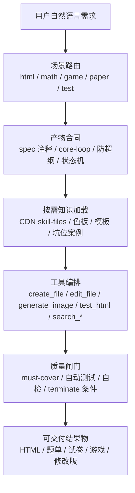

# 飞象 Skills 生产级架构分析报告

## 0. 结论摘要

这组 `飞象Skills` 不是普通提示词集合，而是一套面向真实生产交付的“Agent 操作系统规则层”。它的核心作用不是教模型“怎么写一个 HTML”，而是把飞象在长期生成课件、题目、游戏、数学可视化、自动测试过程中踩过的坑，沉淀成可路由、可按需加载、可机检、可回归的生产纪律。它把自由生成拆成几层控制：先做场景路由，再声明产物合同，再加载必要的设计/技术资源，再调用工具生成或修改，最后用测试 Skill 对用户真实要求做覆盖验证。

最重要的产品洞察是：飞象并没有选择一上来把所有内容都压进 DSL，而是用 Skill 把“生成自由度”和“交付稳定性”之间的矛盾做了分层处理。HTML 仍然是高自由度结果物，Skill 负责把模型的自由创作限制在教学可用、交互可用、视觉可控、资源合规、可被自动化测试的边界内。也就是说，Skill 在飞象里承担的是“生产经验、质量标准、工具编排、产物合同”的综合角色，接近一个可迭代的智能体中间层。

## 1. 文件与模块总览

当前工作区的 `飞象Skills` 共 5 个主目录，约 436KB、7199 行 Markdown，结构上已经呈现出“主 Skill + 附件资源 + 历史版本 + CDN 版本”的生产形态。

| 模块 | 核心文件 | 主要用途 | 产品定位 |
| --- | --- | --- | --- |
| `html-authoring` | `SKILL_v5_主文档.md`、`SKILL_v5_CDN版.md`、`tech-details`、`examples-and-pitfalls`、`grid-templates`、色板文件 | 生成或修改单页教学交互 HTML、教学动画、可打印材料 | 通用 HTML 产物的中枢 Skill |
| `test-html` | `SKILL_v3_当前版.md`、`test-templates_断言模板.md`、v1/v2 历史版 | 对 HTML 结果物做自动化验证 | 质量闸门与回归测试 Skill |
| `math-design` | `SKILL_v1.md`、A/B 色板、`visual-impact` | K12 数学互动 HTML 的视觉、字号、布局规范 | 数学场景的专业设计子系统 |
| `paper-generation` | `SKILL_v1.md` | 命题、找题、组卷、材料情境题 | 题目/试卷类任务的工具编排 Skill |
| `teaching-game-design` | `SKILL_v1.md`、`SKILL_v1_CDN版.md` | 教学游戏、闯关答题、拖拽分类、翻牌配对 | 可玩互动类产物的游戏设计 Skill |

这里的版本形态很值得注意：`html-authoring` 有“主文档”和“CDN版”，差别主要是主文档带 `<skill-content>` 与 `<skill-files>` 包装，后者更像被平台运行时直接消费的纯 Skill 文档；`test-html` 保留 v1/v2/v3，且 v3 明显把大量模板从主文档中拆到 `references/test-templates.md`，说明它已经经历了真实迭代，而不是一次性写出来的静态 prompt。

## 2. 总体架构：Skill 是生产规则层，不是模板库

可以把这套 Skills 理解成五层：

这个架构真正有价值的地方在于，它不是让模型“读完整个知识库再生成”，而是通过路由和读取条件控制上下文加载。比如非数学场景明确禁止读取 `math-design`；数学场景只有涉及坐标系、方格纸、3D 地面网格时才读对应模板；测试时只有写 Playwright 代码前才读断言模板。这种按需加载，是在上下文成本、幻觉风险和专业控制之间做平衡。

从产品角度看，Skill 的本质是把“平台默认智能体”升级成“有岗位 SOP 的专业智能体”。同一个底层模型，在不同 Skill 下会变成课件工程师、数学视觉设计师、游戏设计师、命题教研员、QA 测试员。飞象的能力不只来自模型本身，而来自这些角色化 SOP 对模型行为的约束。

## 3. `html-authoring`：通用 HTML 生成的中枢 Skill

`html-authoring` 是最核心的主干。它覆盖单页教学交互 HTML、教学动画、教学海报、可打印材料、修改已有 HTML 等场景，同时内置数学路由。它的设计目标不是“生成漂亮网页”，而是防止真实交付中的几类失败：空壳产物、按钮无效、需求漏项、媒体 URL 编造、数学场景视觉重复、交互被扁平化、修改时借机重写。

它最强的设计是“核心机制契约”。凡是游戏、答题、模拟器、互动演示、计算器这类有核心闭环的产物，模型必须在写代码前声明最小可玩闭环。比如计算游戏必须包含选数字、选运算符、组合、判定、反馈、换题或重置；拖拽分类必须包含真拖拽、命中判定、错位回弹、提交检查、反馈和重置。这个规则的产品含义很明确：飞象发现模型最容易交付“看起来像产品的空壳”，所以把“Definition of Done”前置到生成之前，而不是等测试时才发现。

另一个关键机制是 `<head>` 里的 `spec` 注释。Skill 要求把用户原文里的可机检硬要求沉淀成机器可读字段，例如数量、页数、字号、音频、格式、数据回收 URL、必含元素、游戏核心闭环。这个设计把自然语言需求变成后续测试可以读取的契约，是生成端和测试端之间的桥。它比单纯依赖聊天上下文可靠，因为跨轮修改、压缩上下文或重新测试时，产物自身仍然携带验收标准。

`html-authoring` 也体现了很强的产品反模式治理。它不允许用户说多个模式时只做一个默认模式；不允许 10 个练习题摊平成长页面；不允许提示文案说“可拖拽”但实际做成滑块；不允许图片、音频用 base64 或编造路径；不允许非数学场景误写 math-design 注释；不允许修改已有 HTML 时重写整个结构。它其实是在对抗模型的几种天然倾向：省略、泛化、重写、视觉套路化、把实现细节伪装成完成。

## 4. `math-design`：不是美术规范，而是数学课件稳定性系统

`math-design` 表面上是视觉设计 Skill，本质上是数学互动课件的稳定性系统。它规定了学段路由、A/B 两类色板、字号、按钮高度、安全区、布局、坐标轴、方格、点阵、3D 地面网格等。和普通设计系统不同，它不是给设计师看的 UI kit，而是给模型执行的机械规则。

最典型的是色板选择逻辑。早期测试发现 54 个数学案例中 Skill 命中率约 50%，命中后 25 套色板只用了 6 种且高度重复 A-01。于是新版规则强制先按学段选 pool，再用知识点查表或 codepoint hash 选具体色板，并要求在推理中显式输出 `keyword / pool / source / palette_id`。这不是为了“随机好看”，而是在解决模型模式坍缩：模型喜欢选最熟悉、最安全、最靠前的方案，生产系统必须用机械规则打散它。

更深的一层是网格纪律。数学场景里，网格不是装饰，而可能是读数、定位、吸附、坐标换算的业务对象。因此 `grid-templates` 反复强调 CSS 背景网格只能做非测量装饰；一旦用户需要方格纸、点阵纸、坐标网格、单位正方形拼图或 3D 地面参照，就必须使用 SVG、Canvas 或 Three.js 中的真实图层，并且与点、线、轴、拖拽吸附共享同一套 `origin / unit / scale`。这说明飞象已经把“视觉正确”提升到了“认知正确”和“可测试正确”：如果坐标轴夹在两条 CSS 方格线之间，肉眼可能还像坐标纸，但教学上已经是错误产物。

`manipulatives` 中标准二维坐标轴的约束也体现同样思路：x/y 字母必须和轴线在同一个 SVG 根节点，不能用 HTML 绝对定位单独贴上去。这个规则看似细，但它解决的是缩放、响应式、截图和测试时坐标轴错位的问题。生产级 Skill 的价值就在这里，它把大量“模型经常犯但单次看不一定致命”的小问题，变成硬约束。

## 5. `test-html`：从“测试模板”演化成“需求覆盖闸门”

`test-html` 的 v3 是这组文件里最能体现生产成熟度的模块。v1/v2 还偏向“告诉模型怎么写 Playwright 测试”，v3 则把主文档压缩成测试纪律：什么时候测、必须覆盖什么、如何从用户需求生成 must-cover 清单、失败时如何归因、什么时候不能判定完成。大量代码模板被外置到 `references/test-templates.md`，说明飞象已经意识到测试的关键不在模板代码，而在测试目标是否覆盖真实需求。

它最重要的规则是 must-cover 清单。测试必须依据本次会话所有用户消息抽取，不只看最近一条；来源包括交互动作、声明式约束、核心玩法闭环、资源可达性。尤其是核心闭环和资源可达性被设为硬门：游戏只测按钮存在不算通过，多文件大厅只测链接存在不算通过，必须真的走端到端流程、真的 `goto` 子页面确认不是 404 或 NoSuchKey。

这套测试 Skill 也把“测试代码自身可能错”纳入了 SOP。默认假设 HTML 有问题，只有 API/语法错、诊断证明断言错、NameError/SyntaxError 等情况才修测试；同一段代码连续失败要切诊断版；同一思路失败三次要换策略；禁止删除失败用例或无理由放宽断言。这些规则说明飞象已经进入“模型自己写测试也会偷懒”的阶段，必须约束测试智能体本身。

从系统设计看，`html-authoring` 的 `spec` 注释和 `test-html` 的 must-cover 是一对闭环：前者把用户要求写入产物，后者读取 spec 播种测试清单。它们共同构成了飞象 HTML 产物的轻量契约层，比纯人工验收稳定，也比强 DSL 保留了更多生成自由度。

## 6. `teaching-game-design`：专门治理“好看但不好玩”

`teaching-game-design` 是可玩互动类任务的专业 Skill，覆盖闯关答题、拖拽连线、翻牌配对、限时挑战等。它的核心不是视觉风格，而是游戏系统结构：生命周期状态机、单向数据流、题库结构、即时反馈、难度曲线、激励机制。

它要求游戏必须有引导说明页、游戏主体、反馈系统、结算页；每关 3-5 题，关卡间难度递增；反馈必须在每次作答后 200ms 内触发；正确和错误都有视觉、动画、文字，音效可用 Web Audio API 生成；按钮点击区要适配移动端。这些规则在产品上解决的是“教学小游戏生成后只有题目堆叠，没有游戏感”的问题。

和 `html-authoring` 的关系上，它更像上层专业封装。`html-authoring` 已经有核心机制契约，但 `teaching-game-design` 把游戏类场景进一步具体化为状态机和反馈系统。理想运行时应该是：用户命中教学游戏意图时先路由到 `teaching-game-design`，再借用 `html-authoring` 的 HTML 技术和资源约束，最后用 `test-html` 验核心闭环。当前文件里这种协作关系主要靠描述和工具约定，还不是机器可读依赖图，这是后续平台化可以补强的点。

## 7. `paper-generation`：题目生产不是生成，而是检索、教研和防超纲

`paper-generation` 和 HTML 类 Skill 明显不同，它不是结果物前端生成，而是命题/找题/组卷的工具编排 SOP。它要求先确认学科、学段、知识点三要素；根据意图路由到按卷查题、按知识点查题、专题整理、按卷搜卷、改编命题、套卷组题、新材料新情境命题等模式；最终必须调用 `create_question_sheet`、`create_question_paper` 或按试卷 ID 创建结果。

这个 Skill 的核心风险不是“页面不好看”，而是“超纲”和“工具召回失败”。因此它强调 `search_keypoints` 必须先做，`search_questions` 必须使用知识图谱标准名；按知识点出题必须先做防超纲分析；找不到题不能直接告诉用户没搜到，而要按参数错误 SOP 扩大召回或切换工具；阅读材料题必须走 `insert_sop`，并通过 `consult_expert`、`detect_beyond_words` 等工具检查文本长度、超纲词、命题质量。

这说明飞象对不同产物类型采用了不同的生产逻辑：HTML 产物靠代码生成和测试闭环，题目产物靠检索、筛选、教研判断和防超纲。Skill 不是统一范式，而是按业务风险设计的智能体岗位说明书。

## 8. 外部资源与接口设计

从这些文件能推断出飞象的生产接口至少包括几类：

| 接口/工具族 | 典型工具 | 在 Skill 中的作用 |
| --- | --- | --- |
| Skill 加载 | `call_skill`、`read_url`、`read_file` | 主 Skill 先加载，附件通过 `<skill-files>` 中的 CDN URL 按需读取 |
| 文件生成 | `create_file`、`edit_file`、`read_file` | 生成、读取、修改 HTML 或交付文档 |
| 资源生成 | `generate_image`、`generate_voice` | 生成图片和语音，返回飞象域 URL，禁止 base64 和外站资源 |
| HTML 验证 | `test_html` | 云端 Playwright 自动化测试，验证渲染、响应式、核心交互、资源可达性 |
| 教研检索 | `search_papers`、`filter_questions`、`search_questions`、`search_keypoints`、`search_resources`、`search_web` | 支撑命题、找题、材料检索和知识点标准化 |
| 教研判断 | `consult_expert`、`detect_beyond_words`、`insert_sop` | 处理材料题、超纲词、命题质量、专项 SOP |
| 交付结束 | `terminate` | 明确任务完成，但多个 Skill 规定不满足硬门时禁止结束 |

这里最关键的是资源策略。`html-authoring` 的主文档带有 `<skill-files>` 表，附件 URL 指向 `https://musk-online.fbcontent.cn/pub-musk-ai-studio/skills/...`，而媒体资源白名单也限制在飞象域 `*.fbcontent.cn` 和素材库路径。它说明飞象的 Skill 不只是本地 prompt，而是通过 CDN 分发的版本化资源包；运行时可先拿主 Skill，再按需 `read_url` 拉取色板、模板、坑位案例。这个设计让 Skill 可以持续迭代，同时避免每次都把大附件塞进模型上下文。

同样值得注意的是，常用前端库 CDN URL 并不在 Skill 文件里重复定义，而是交给 System Prompt 的“外部库 CDN 白名单”。这是一种分层治理：Skill 管业务和工程纪律，系统级规则管全局依赖白名单。好处是多个 Skill 共享同一套库源，坏处是 Skill 离开原运行环境后会缺上下文，复用时必须补齐系统约束。

## 9. 生产级设计的核心模式

### 9.1 从自然语言到可执行合同

飞象 Skills 最大的工程化价值，是把用户自然语言中的模糊要求转成多个可执行合同：`spec` 注释、`core-loop`、首行 palette 注释、grid_intent、must-cover 清单、防超纲分析、状态机字段。这些合同不是为了展示给用户，而是为了让后续智能体、测试工具和修改流程有稳定抓手。

### 9.2 用硬约束治理模型弱点

这些文件里大量出现“禁止、必须、不得、严禁”，不是写作风格问题，而是生产经验。模型容易问用户、懒得推断、跳过测试、选择第一个色板、编造 URL、把按钮画出来不接线、把数学网格当背景、在修改时重写全文件。Skill 通过硬约束把这些问题前置拦截。

### 9.3 把审美问题转成机制问题

很多视觉规范并不是单纯审美。例如色板随机是为了防止模式重复；H1=40px、按钮=80px、安全区是为了课堂大屏可读；3D 地面网格阈值是为了避免视觉误导；图片 `object-fit: contain` 是为了防止教学主体被裁掉。飞象把“好不好看”拆成了可执行、可测试、可复用的视觉机制。

### 9.4 测试不只测代码，还测需求覆盖

`test-html` 的 v3 说明飞象已经意识到，自动化测试如果只测页面存在、按钮存在，会给模型错误激励。真正的测试必须覆盖用户原始需求和核心闭环，尤其要验证交互结果、错误反馈、资源可达性和响应式边界。测试 Skill 本身也需要 SOP，防止测试智能体偷懒。

## 10. 风险与不足

第一，当前 Skill 仍然大量依赖自然语言硬约束，机器可读性不足。比如 Skill 之间的依赖关系、触发优先级、必读附件、禁止附件、工具前置条件，大多写在正文中，运行时需要模型理解。更稳的方式是把这些变成 manifest：`triggers`、`depends_on`、`forbidden_skills`、`required_tools`、`output_contract`、`test_contract`。

第二，部分约束可能造成过拟合。比如数学字号、按钮高度、色板选择算法、控件数量限制都很强，在 K12 大屏课件里合理，但换到移动端练习、教师备课文档、开放式创意课件时可能过硬。生产系统需要区分“红线”和“默认建议”，否则 Skill 会让产物稳定但僵硬。

第三，系统 prompt 依赖较重。外部库 CDN 白名单、工具能力、飞象域媒体规则、`test_html` 运行方式并不完全自包含在 Skill 文件里。如果我们复用这套模式，不能只复制 Skill 文档，还要复制运行时工具协议、资源白名单、文件生命周期和测试返回格式。

第四，Skill 版本化还不完整。文件里有 v1/v2/v3/v5 和 CDN 版，但没有看到统一 changelog、兼容策略、回滚机制和线上命中率指标。真实生产中，Skill 变更很容易影响大量生成质量，应该配套评测集和灰度发布。

## 11. 对我们 MVP 的启发

如果我们要做 AI 互动内容工作台，最值得借鉴的不是某一个具体规则，而是飞象的分层方式。MVP 不应一开始把所有内容都压进 DSL，也不应只让 Agent 自由写 HTML。更现实的路径是：最终交付仍然统一为 HTML，但在 Agent 前后加上 Skill 合同和测试合同。

建议我们第一阶段做五类最小 Skill：

| Skill | 解决的问题 | MVP 必备程度 |
| --- | --- | --- |
| `html-authoring` | 通用 HTML 生成、修改、资源合规、交互闭环 | 必做 |
| `interactive-exercise` | 课后练习题型、作答、反馈、结果状态、SCORM 预留字段 | 必做 |
| `teaching-animation` | 课中课件/教学动画的叙事、步骤、控制器、演示区 | 必做 |
| `test-html` | 需求覆盖、核心闭环、响应式、资源可达性验证 | 必做 |
| `math-visual` | 数学可视化的坐标轴、网格、图形、色板 | 可先做子集 |

产品侧要特别保留 `spec` 这一层。它可以成为工作台里“任务验收标准”的可视化来源：用户输入需求后，系统自动抽取可机检要求，展示给用户或内部调试；Agent 生成 HTML 时写入 `<head>`；测试时读取并转成 must-cover；修改时保留并增量更新。这个机制比单纯保存聊天记录更可靠，也比完整 DSL 更轻。

更进一步，Skill 可以成为产品内的“场景封装”实体。每个场景不是一个固定模板，而是一组路由规则、设计规则、工具权限、资源白名单、产物合同、测试合同和失败 SOP。这样产品侧既能保留 AI 生成的自由度，又能把质量控制沉淀成可版本化资产。

## 12. 建议的下一步拆解

后续如果要继续深挖，建议不要只读 Markdown，还要结合接口抓包还原运行时链路：`call_skill` 返回结构、`skill-files` CDN 拉取时机、`generate_image/generate_voice` 返回字段、`create_file/edit_file` 的 resourceId 生命周期、`test_html` 返回的 pass/console/screenshot 格式、`publish_resource` 是否作为最终发布闸门。当前文件已经能证明飞象的 Skill 是生产级规则层，但要复刻或超越它，还需要把“文档规则”进一步转成“运行时协议”。

我对这组 Skill 的总体判断是：飞象已经把 AI 内容生成从“Prompt 驱动”推进到“Skill + Tool + Test 的工程化驱动”。它没有完全牺牲 HTML 自由度，而是用技能路由、按需资源、产物契约和测试闸门，把大模型的不稳定性压进可管理边界。对我们而言，这比单纯讨论 DSL 更有参考价值：DSL 解决结构一致性，Skill 解决生产行为一致性，真正可交付的系统需要两者在不同层级配合。
