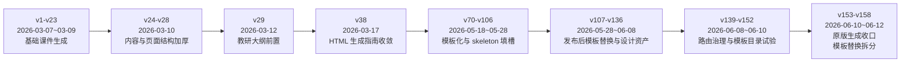
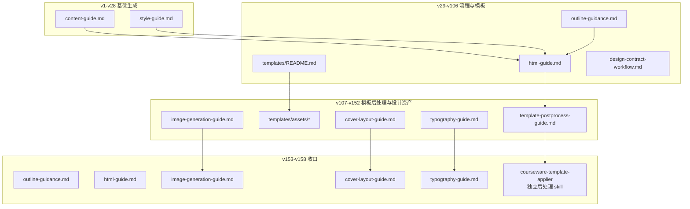
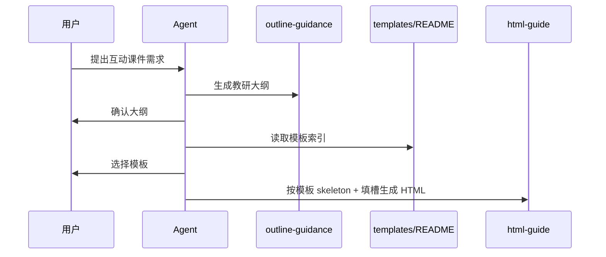
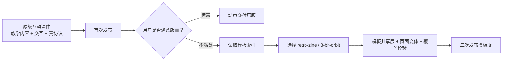
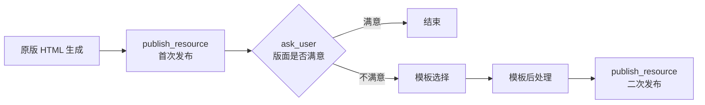
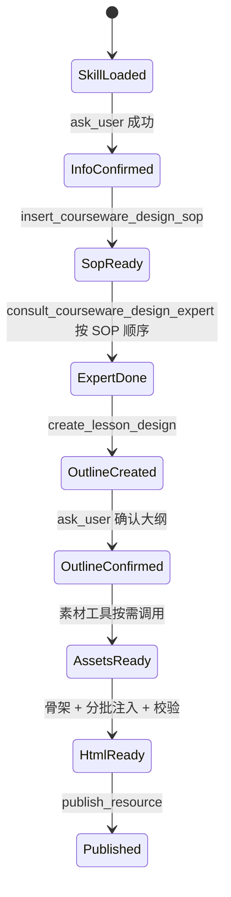
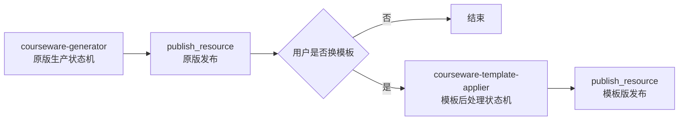
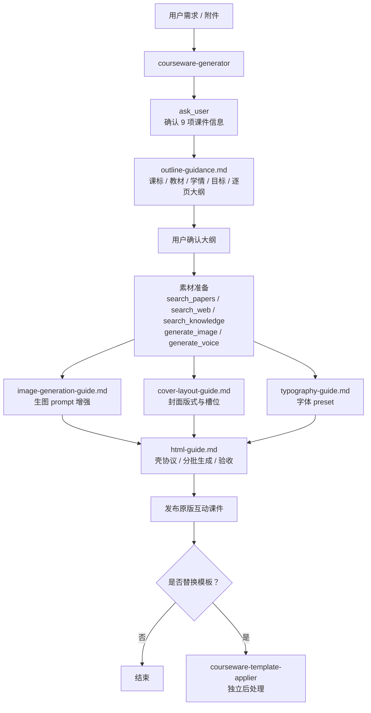

# courseware-generator v1-v158 演进分析

报告生成日期：2026-06-29

## 0. 阅读说明

本文基于 `skills_test/courseware-generator/v1` 至 `v158` 的完整版本目录做相邻版本 diff，而不是只读取 `SKILL.md`。分析范围包括主技能文件、教研大纲指南、HTML 生成指南、模板索引、模板资产、发布后模板替换指南、生图指南、封面版式指南、字体指南等所有配套子文件。

本文所有版本日期均同步自各版本 `SKILL.md` 正文中的 `创建日期：YYYY-MM-DD`。该字段由脚本重新请求 CDN HTTP 头生成，来源是对象的 `Last-Modified`。CDN 未暴露独立的源码 commit time / created-at 字段；对按版本号固化的路径而言，`Last-Modified` 是当前可获得的最接近“版本对象创建/提交到 OSS”的时间。

### 执行摘要

这份报告建议按三条线阅读。第一条是产品线：`courseware-generator` 从“生成多页 HTML”演进为“教研大纲、素材准备、原版发布、模板后处理”的完整服务链路。第二条是工程线：它从单份 prompt 说明演进为多文件协议，核心资产逐步拆成 `outline-guidance.md`、`html-guide.md`、模板资产、生图、封面、字体等模块。第三条是工具线：工具调用从“可用则调用”演进为强状态机，`ask_user`、SOP、专家、大纲、素材、文件编辑、发布之间被写成严格顺序。

最关键的判断有四个：

- 线上最高 v18 并不对应测试最新 v158，而是对应测试 v97-v99 附近的能力线。
- v102 之后的大量测试迭代，主要是在治理模板、工具编排、设计资产和 skill 拆分。
- v153 是架构收口点：主 skill 只负责原版互动课件，模板替换交给 `courseware-template-applier`。
- 下一步更应该把 `lockedPageCount`、`expertId`、`latestResourceId` 等状态产品化为运行时变量，而不是继续把更多“禁止/必须”写进长文档。

### 阅读路径

| 如果你关心 | 建议重点阅读 |
|---|---|
| 产品演进 | 第 1、3、8、9 章 |
| 文件架构 | 第 2、3、7 章 |
| 工具和 Agent 编排 | 第 4 章 |
| 线上/测试版本关系 | 第 5 章 |
| 关键版本索引 | 第 6 章 |

## 1. 总览判断

`courseware-generator` 的 158 个版本并不是简单的 prompt 修辞迭代，而是一条非常清晰的产品工程化路径：先把“多页 HTML 课件”跑通，再把“专业教研设计”前置，再引入“视觉模板和素材资产”，随后围绕 Agent 工具调用、技能路由、壳协议、模板替换稳定性持续加硬闸门，最终在 v153 之后把主技能收口为“原版互动课件生成”，将模板替换分离给独立的 `courseware-template-applier`。

从产品角度看，它从一个“课件生成器”演进为“互动课件生产流水线”。用户需求不再直接变成 HTML，而是经过信息确认、教研大纲、用户确认、素材准备、原版 HTML 生成、发布验收、可选模板后处理。从技术角度看，它从一份生成说明演进为一套 Agent 执行协议：哪些工具能先调用、哪些文件必须读取、页数如何锁定、壳脚本如何引用、模板资产如何注入、错误调用如何回滚，都被写入技能文档。



## 2. 文件体系演进

这套技能最值得看的不是某一版 `SKILL.md` 写了什么，而是文件体系如何被拆开。每一次新增或移除子文件，基本都对应一次产品职责重划。

| 阶段 | 创建日期范围 | 主要文件形态 | 关键变化 | 产品含义 | 技术含义 |
|---|---|---|---|---|---|
| v1-v28 | 2026-03-07~2026-03-10 | `SKILL.md`、`content-guide.md`、`style-guide.md` | 内容生成与 HTML 样式分离 | 先证明可以生成多页课件 | 以 `<template>`、960×540、壳框架为核心协议 |
| v29-v37 | 2026-03-12~2026-03-16 | 新增 `outline-guidance.md` | 教研大纲生成独立出来 | 从“生成内容”升级为“先做教学设计” | 把大纲、素材、HTML 生成拆成 Phase |
| v38-v69 | 2026-03-17~2026-05-12 | `content-guide.md`、`style-guide.md` 合并为 `html-guide.md` | HTML 生成职责统一 | 课件输出标准化 | 分批注入、复杂度评估、壳约束集中管理 |
| v70-v106 | 2026-05-18~2026-05-28 | 新增 `templates/README.md`，短暂新增 `templates/design-contract-workflow.md` | 模板选择、模板契约、skeleton + 填槽 | 追求视觉一致性 | 模板文件过长后，引入契约压缩以控 token |
| v107-v130 | 2026-05-28~2026-06-06 | 新增 `template-postprocess-guide.md`、`templates/retro-zine.md`、`templates/8-bit-orbit.md`、`templates/assets/...` | 模板从“前置生成”转向“发布后替换” | 先交付原版，再给用户换版面 | 降低模板对互动结构和壳协议的破坏 |
| v131-v136 | 2026-06-08 | 新增 `image-generation-guide.md`、`cover-layout-guide.md`、`typography-guide.md` | 生图、封面、字体设计资产化 | 原版课件本身开始追求设计质量 | 视觉规则沉淀为可读取合同 |
| v139-v152 | 2026-06-08~2026-06-10 | 多次删除/恢复模板资产，并尝试根级模板目录 | 模板目录结构反复试验 | 探索模板资产的加载成本和可维护性 | CDN 路径、上下文体积、引用稳定性成为问题 |
| v153-v158 | 2026-06-10~2026-06-12 | 保留原版生成相关指南，移除模板资产 | 模板替换交给 `courseware-template-applier` | 主流程聚焦原版互动课件 | 主技能边界收窄，后处理独立化 |



## 3. 关键版本时间线

这一节按“原文写法变化 → 可能触发原因 → 架构后果”来读。为了避免把 158 个版本堆成流水账，下面只展开对产品形态或工程边界有实质影响的版本；小版本如果只是同一规则的措辞、字段、路径修正，会合并到相邻阶段说明。

### 3.1 v1-v23（2026-03-07~2026-03-09）：基础课件生成器

早期版本只有 3 个文件，总体目标是生成“多页 PPT 式教学课件（HTML 格式）”。`content-guide.md` 负责确认参数、检索资料、规划内容、分批生成；`style-guide.md` 负责 HTML 结构、`<template>` 标签、960×540 画布、共享资源和壳框架约束。

原文里的能力边界还比较轻，`description` 主要是这样的写法：

> 涵盖内容规划（确认参数→检索教案→规划大纲→分批生成）与HTML格式输出（template标签页面结构、960×540画布、壳框架集成）。

这句话里有两个早期特征。第一，流程仍以“内容规划”为中心，教研、素材、HTML 都挤在同一条线上；第二，产物协议已经先于产品包装出现，`template`、画布尺寸、壳框架是最早被固定的东西。这说明团队一开始就知道飞象课件不是普通网页，而是必须放进特定播放器里的结构化 HTML。

更细地看，早期的文件拆分是“内容 vs 样式”：

| 文件 | 当时承担的职责 | 后续命运 |
|---|---|---|
| `content-guide.md` | 用户确认、资料检索、页面内容规划、分批生成 | v38 前逐渐退化为 HTML 内容子流程，最终被 `html-guide.md` 吸收 |
| `style-guide.md` | HTML 结构、CSS、壳约束、共享资源 | v38 被 `html-guide.md` 吸收 |

为什么要这么拆？因为早期最容易失败的是“生成出来不能播”而不是“教学设计不够专业”。所以规则先围绕 HTML 壳协议建立，产品上看起来是课件生成，工程上其实是在给一个固定播放器喂标准页面数据。

### 3.2 v24-v28（2026-03-10）：页面内容结构加厚

v24 开始，`content-guide.md` 连续变大，加入封面页、逐页结构、复杂度评估和分批生成细节。这个阶段看起来像线上生成质量暴露出两个问题：一是课件内容容易变成一长段说明，缺少页面级组织；二是模型容易一次性生成，导致页数、结构、资源引用不可控。

这个阶段的原文变化不如 v29 那么显眼，但从目录体积能看出重心：`content-guide.md` 从 v1 的约 7k 字节增长到 v28 的约 27k 字节。它不是在加“更多题材”，而是在加页面级生产规则，例如封面页、逐页表、复杂度评估、分批注入。

这背后的失败场景很容易推出来：如果模型一次性生成完整课件，页面数量和大纲不容易对齐；如果没有封面/正文/练习/总结的页面角色，后续模板也没有可以映射的结构；如果没有复杂度评估，强互动页和普通讲解页会被同等处理，结果要么互动太弱，要么 HTML 太长。

所以 v24-v28 可以理解为“页面对象化”的准备期。它还没形成完整教研链路，但已经开始把课件从一份文档拆成多个可检查的 page object。这个动作非常重要，因为后续模板替换、页数锁定、封面槽位、生图素材，全都依赖页面结构稳定。

### 3.3 v29（2026-03-12）：教研大纲前置，第一次架构跃迁

v29 新增 `outline-guidance.md`，这是第一个真正的大版本。主流程从“确认参数、检索教案、规划大纲、分批生成”改为“课标研读、教材梳理、学情分析、目标拟定、逐页设计、用户确认修改、HTML 分批生成”。`content-guide.md` 被重新定位为 Phase 4 子流程，只基于已确认大纲生成 HTML。

v29 的 `description` 写法已经从“内容规划”改成了更像教研流程的表达：

> 涵盖专业大纲生成（课标研读→教材梳理→学情分析→目标拟定→逐页设计）→ 用户确认修改 → HTML分批生成。

`SKILL.md` 里也第一次出现清晰的 Phase 分层：

```text
Phase 1: 大纲生成
Phase 2: 大纲确认与修改
Phase 3: 素材准备
Phase 4: HTML 课件生成
Phase 5: 验收与交付
```

这不是简单把流程写得更漂亮。它解决的是产品信任问题：老师不一定信任“AI 直接给我生成 15 页课件”，但会更容易接受“先按课标、教材、学情生成大纲，我确认后再做课件”。也就是说，v29 把一次性生成改成了“先设计、再生产”的服务模型。

工具层也在 v29 开始出现专业分工。`outline-guidance.md` 里已经有类似这样的写法：

> 执行 SOP 前，也必须先执行信息确认机制，保障内容清晰。

> `expertId` 由本工具自动生成，禁止模型自行编造或猜测。

这说明教研不再只是 prompt 内部思考，而是借助 SOP 和专家工具完成的外部流程。后面 v118-v134 的工具硬闸门，本质上都是从这里长出来的。

### 3.4 v38（2026-03-17）：HTML 生成职责统一，第二次架构跃迁

v38 删除 `content-guide.md` 和 `style-guide.md`，新增 `html-guide.md`。这一步把内容生成、样式规范、壳协议、分批注入和验收交付统一到一个 HTML 生成指南里。

v38 的文件表述非常直接：

| v29 前后 | v38 之后 |
|---|---|
| `content-guide.md`：HTML 内容生成指南 | 被移除 |
| `style-guide.md`：HTML 格式与样式规范 | 被移除 |
| `html-guide.md` | 新增，成为“HTML生成完整指南” |

`SKILL.md` 对 `html-guide.md` 的描述是：

> `<template>` 标签用法、960×540 画布规则、壳框架约束、互动状态管理、复杂度评估、骨架创建→分批生成页面→验收交付。

为什么要把 content 和 style 合并？因为在飞象课件里，内容结构和 HTML 结构不能分开治理。比如“课堂练习页”不仅是文本内容，还决定是否需要选项按钮、反馈状态、脚本恢复、图片素材和壳内翻页表现。如果内容指南和样式指南分开，模型很容易在一个文件里规划页面，在另一个文件里忘掉互动状态。

所以 v38 的真实含义是：HTML 不是最后的排版环节，而是课件产品的执行层。`outline-guidance.md` 负责“教什么”，`html-guide.md` 负责“如何变成可运行互动课件”。从这个版本开始，课件生成的工程重点明显从“文本内容”转到“可运行 HTML 产物”。

### 3.5 v70-v90（2026-05-18~2026-05-20）：模板化探索，从自由生成到 skeleton + 填槽

v70 新增 `templates/README.md`，首次引入模板选择，主流程增加 Phase 2.5。用户确认大纲后，需要选择视觉模板；HTML 生成时要读取模板 CSS、layout 和样张，把模板贯穿整份课件。v81-v90 进一步强化模板规则，明确模板不能只作用于封面，不能只改配色，不能破坏强互动页。

v70 的原文里，模板还比较像“风格选择”：

> 读取 templates/README.md → 列出所有可用模板  
> 调用 ask_user 让用户选择风格模板（含“不使用模板，AI 自由发挥”保底选项）  
> 记录用户选定的模板 ID，传递给 Phase 3 和 Phase 4

到 v90，`html-guide.md` 的写法明显变硬：

> 如果 Phase 2.5 用户选了某个视觉模板，整份 HTML 生成流程改为「skeleton + 填槽」模式。

> 禁止自己手写骨架。骨架由模板提供。

这中间的演进很关键。v70 的模板像产品体验入口，给用户一个“黑板风、撞色风、数学探索风”的选择；v90 的模板则变成工程生成协议，要求模型不要自由写骨架，而是读模板 skeleton，再填入页面内容。

为什么会从“风格模板”收紧到“骨架模板”？大概率是因为早期模板选择无法约束模型。模型可能只在封面用了模板色，正文又回到默认风格；也可能读了模板说明，但每页自己重写结构，导致页面之间不一致。于是文档开始把模板从“参考风格”升级为“代码来源”。

这里也埋下了后续问题：模板骨架越强，越容易压住互动页；模板文件越多，越吃上下文；模板越像代码资产，越需要路径、读取顺序和占位符校验。v102-v106 的红线，就是对这些问题的集中补救。



### 3.6 v102-v106（2026-05-27~2026-05-28）：模板红线和设计契约

v102 是模板化路线的爆发版本。`SKILL.md` 大幅增加四类红线：必须先确认 9 项信息，模板选择不能跳过，页数必须一致，模板占位符必须清零且壳脚本必须正确。v105 新增 `templates/design-contract-workflow.md`，要求先把模板原文件压缩成 `designContractSummary`、`shellCompatibilityChecklist`、`pageTypeMap`、`layoutMap` 等契约，再生成页面。

v102 的标题本身就显示出语气变化：

```text
🚨 四条不可违反的红线（最高优先级）
红线 1：必须执行信息确认（Phase 1 第一步）
红线 2：选定模板后，必须按模板规范生成整份课件
红线 3：页数一致 + 禁止跳过分批注入（极致命）
红线 4：模板占位符必须清零 + 壳脚本必须正确
```

这些红线不是抽象规范，而是从具体失败里长出来的：

| 红线 | 对应的线上失败 | 为什么必须写死 |
|---|---|---|
| 必须先 `ask_user` 确认 9 项字段 | 模型觉得用户说得够清楚，直接生成大纲 | 教研 SOP 需要结构化输入，否则后续专家和大纲都会偏 |
| 模板必须贯穿整份课件 | 只在封面套模板，正文回默认样式 | 用户选择模板后期待整份课件一致 |
| 页数一致，不能跳过分批注入 | 大纲 15 页，HTML 只生成 8 页；或一次性塞完整 HTML | 壳协议和课件验收都依赖页数稳定 |
| 占位符清零，壳脚本正确 | `{{P1_TITLE}}` 等模板占位符残留；脚本换错 CDN | 这类错误会直接导致交付物不可用 |

v105 又往前走了一步，把模板处理抽象成“壳兼容设计契约”。原文里写得很清楚：

> 大纲确认且模板选择完成后、HTML 生成前，必须先把所选模板编译成一份壳兼容设计契约。只有在契约完成后，才能继续准备素材和搭空课件框架。

它还解释了为什么要做契约：

> 避免模型在 Phase 5 继续反复读模板原文件，造成 token 过长、风格漂移或与壳冲突。

这个设计其实很工程化：让模型先读大模板，再生成一份短契约，后续页面都按契约执行。它像是在 prompt 层手工实现“模板编译器”。只是从后续 v107 的路线看，团队可能发现前置模板契约仍然过重：模板仍然会影响原版内容生成，模板和互动结构的冲突也没有完全消失，于是路线转向发布后替换。

### 3.7 v107-v116（2026-05-28~2026-06-06）：发布后模板替换路线成型

v107 新增 `template-postprocess-guide.md`、`templates/retro-zine.md` 和 `templates/8-bit-orbit.md`。这是第三次架构跃迁：模板不再必须在原版生成前强绑定，而是变成“首次发布原版后，再按用户意愿做版面替换”。v110 开始加入真实模板资产，包括 `tokens.css`、`page-shared.css`、`component-snippets.html`，v112-v116 对这些资产持续扩充。

v107 的 `SKILL.md` 已经把流程改成 7 个 Phase，其中新增了两个关键阶段：

```text
Phase 5：验收与首次交付
Phase 6：发布后版面满意度确认
Phase 7：模板替换与二次交付
```

原文中特别强调：

> 首次发布不可跳过：即使后续计划支持换版面，也必须先把基础互动课件完整发布给用户，不能直接把发布动作挪到模板替换之后。

这句话是产品架构的关键。它把课件生产拆成“可用性优先”和“美化后处理”两段。先让老师拿到一个能播放、能互动、内容完整的原版，再询问是否要换版面。这比一开始就选择模板更稳，因为模板不再影响教研大纲和交互结构。

`template-postprocess-guide.md` 的目标也很克制：不是重做课件，而是“发布后版面替换”。模板说明书里开始出现 `retro-zine`、`8-bit-orbit` 这种明确风格资产；到 v110，模板从说明文变成真实代码资产：

| 文件 | 意义 |
|---|---|
| `tokens.css` | 颜色、字体、间距等视觉变量 |
| `page-shared.css` | 写入 `page-shared` 的共享模板层 |
| `component-snippets.html` | 可复用装饰和组件片段 |
| `templates/retro-zine.md` / `templates/8-bit-orbit.md` | 模板读取顺序、页面映射、替换边界 |

为什么发布后替换比前置模板更合理？因为互动课件有两个优先级：第一是教学结构和互动可运行，第二才是视觉风格。前置模板容易让模型为了适配 layout 牺牲内容页数或互动复杂度；后置模板则能把视觉替换限制在已生成 HTML 的表层，减少对交互脚本的破坏。



### 3.8 v118-v130（2026-06-06）：工具调用治理和路由防火墙

v118 之后，文档里出现大量运行安全闸门：加载技能这一轮只能调用 `call_skill`，读取技能后下一轮只能单独 `ask_user`，用户确认前不能并发 SOP、搜索、专家咨询或大纲生成；同时反复强调不得与 `math-design`、`interaction-design` 等单页设计技能混用。

v120 之后的 `description` 已经不是在介绍能力，而是在约束工具调用：

> 调用本技能的这一轮只能调用 call_skill 一个工具，禁止同轮调用 insert_courseware_design_sop、搜索、专家咨询或大纲生成。

> 读取 SKILL.md 后，除附件读取外，下一轮业务动作只能单独 ask_user 确认 9 项课件信息。

到 v125，约束继续加硬：

> 调用本技能的这一轮只能调用 call_skill(courseware-generator) 一个工具，禁止同轮调用其他技能。

这类写法说明他们遇到的不是“模型不知道怎么做”，而是“模型太想一次做很多事”。多工具并发在普通任务里可能提高效率，但在课件生成里会破坏状态顺序：还没确认信息就拿 SOP，SOP 返回的 `expertId` 与用户最终确认不一致；还没编辑完 HTML 就发布，用户看到旧版本；同轮加载 `math-design`，模型开始按单页数学设计而不是多页课件生产来做。

路由防火墙也在这段加强。v134 的 `description` 里已经明确写到：

> 当用户要“互动课件/课件生成/多页课件”时，即使主题是数学、鸡兔同笼、方程、几何等，也只能加载 courseware-generator，严禁同轮同时加载 math-design、interaction-design 或 html-authoring。

为什么要点名“鸡兔同笼、方程、几何”？这通常不是随手举例，而是线上实际误路由高频场景。用户说“做一个鸡兔同笼互动课件”，路由器很容易因为“数学”触发 `math-design`，但用户真正要的是完整多页互动课件。于是文档不得不把“任务形态”置于“学科主题”之上：多页课件优先级高于数学单页设计。

### 3.9 v131-v136（2026-06-08）：设计资产体系扩展

v131 新增 `image-generation-guide.md`，v133 新增 `cover-layout-guide.md`，v136 新增 `typography-guide.md`。这是第四次明显跃迁：原版课件不再只是“先生成再换模板”，而是原版本身也要有设计质量。

这段的原文变化体现出一个新方向：原版课件不能再只是“可用”，也要“像设计师做过”。v153 之后保留下来的指南也证明，这些不是模板路线的附属品，而是原版生成的核心资产。

三个新增指南各自对应一个具体质量问题：

| 指南 | 原文重点 | 它解决的问题 |
|---|---|---|
| `image-generation-guide.md` | 只在准备调用 `generate_image` 时读取；按单张图片描述判断是否命中类型→风格映射 | 避免所有图片都套同一种风格，也避免 prompt 过泛 |
| `cover-layout-guide.md` | 用于封面生图前确定图片槽位，也用于首次生成第 1 页封面结构 | 避免封面自由排版、标题压图、图片比例错误 |
| `typography-guide.md` | 原版 HTML 生成前选择 1 套字体 preset，写入 `page-shared` 并贯穿原版课件 | 避免模型写不存在的字体或每页字体漂移 |

这里尤其值得注意的是封面。v133 的封面指南还是 7 种版式范式，v156 已经变成“固定代码版式合同”。原文写法非常强：

> 生成第 1 页封面时，必须先选择一个 `data-cover-layout`，然后复制本节对应的 CSS 块和 HTML 骨架。模型只能替换字段，不能重写结构，不能改槽位坐标。

这说明他们可能反复遇到封面图被裁切、标题位置漂移、模型用 flex/grid 自由重写导致 960×540 坐标失效的问题。于是设计规则从“建议”升级成“代码合同”。

### 3.10 v139-v144（2026-06-08~2026-06-09）：完整指南版与极简硬闸门版的拉扯

v139-v142 保持完整体系，包含模板后处理、模板资产、生图、封面、字体等文件；v143 突然删除多个子文件，`SKILL.md` 大幅压缩，只保留最高优先级硬闸门、流程、文件读取顺序和常见失败恢复；v144 又恢复完整体系。

v143 的文件数从 v142 的 16 个降到 12 个，`SKILL.md` 也缩到约 4k 字符。它保留的是高度压缩后的硬规则，例如：

```text
最高优先级硬闸门
流程
Phase 1 信息确认与大纲生成
Phase 2 大纲确认
Phase 3 素材准备
Phase 4 HTML 原版生成
Phase 5 原版发布
Phase 6/7 模板注入与二次发布
文件读取顺序
常见失败恢复
最终交付
```

这个版本像是一次“把大文档压成运行手册”的尝试。它的优点是路由和流程更醒目，模型不容易被长文档淹没；缺点是设计资产的细节被削弱，尤其封面、生图、字体、模板后处理这类需要具体代码和参数的能力，不能靠几条摘要稳定执行。

v144 恢复完整体系，说明团队更倾向于保留细颗粒度指南，但把主文档写成索引和闸门。这也是 v158 最终形态的方向：不要让 `SKILL.md` 背所有细节，而是让它负责调度子文件。

### 3.11 v147-v152（2026-06-10）：模板目录结构试验与回撤

v147 删除 `templates/` 下大量资产；v148-v150 又把模板文件挪到根级 `README.md`、`8-bit-orbit.md`、`retro-zine.md`、`assets/...`；v151 再迁回 `templates/...`；v152 大幅删除模板资产，只保留少量核心文件。

这一段的目录变动比文字更说明问题：

| 版本 | 创建日期 | 目录行为 | 可能目的 |
|---|---|---|---|
| v147 | 2026-06-10 | 删除 `templates/assets/...` 等模板资产 | 降低主 skill 体积，测试轻量化 |
| v148-v150 | 2026-06-10 | 模板文件移到根级 `README.md`、`8-bit-orbit.md`、`retro-zine.md`、`assets/...` | 测试更短路径或不同资源引用方式 |
| v151 | 2026-06-10 | 又迁回 `templates/...` | 根级结构可能不符合既有读取约定 |
| v152 | 2026-06-10 | 大幅删除模板资产，只保留主流程和后处理指南 | 为模板拆分做准备 |

这说明模板系统已经从 prompt 设计问题变成资源工程问题。模板资产不是几句描述，而是 CSS、HTML 片段、token、页面映射和校验规则。继续塞在 `courseware-generator` 里，会让主技能的加载、读取、版本管理都变复杂。v153 把它拆出去，是资源边界和产品边界同时收口。

### 3.12 v153-v158（2026-06-10~2026-06-12）：主流程收口，模板替换拆分

v153 是最后一次关键架构重构。`SKILL.md` 明确主流程只负责生成“原版互动课件”：专业大纲生成、用户确认、原版素材准备、生图 prompt 增强、封面图槽位约束、原版 HTML 分批生成、发布原版课件。模板替换规则不再由本 skill 承载，原版发布后如果用户确认要替换模板，交由独立 `courseware-template-applier`。

v153 的 `description` 是整条演进线的收束版，原文核心是：

> 主流程负责生成原版互动课件：专业大纲生成 → 用户确认修改 → 原版素材准备 → 原版 HTML 分批生成 → 发布原版课件。

同时它明确写出边界：

> 本 skill 禁止承载、读取或执行模板替换规则；原版发布后如用户确认开始替换模板，交由独立 courseware-template-applier skill 处理。

这句话非常重要。它不是“少做一个功能”，而是把两个不同产品任务拆开：

| 主流程 | 模板替换后处理 |
|---|---|
| 目标是生成可用的原版互动课件 | 目标是在已发布原版上替换视觉版面 |
| 关心教研、大纲、素材、HTML、壳协议 | 关心模板资产、视觉覆盖、结构不破坏 |
| 失败会导致课件不存在或不可用 | 失败主要影响美观和二次版本 |
| 应由 `courseware-generator` 控制 | 应由 `courseware-template-applier` 控制 |

v156-v158 继续打磨封面和生图规则。`cover-layout-guide.md` 从“版式建议”升级为“固定 960×540 坐标合同”，局部封面图要求写入槽位尺寸、比例和构图安全区；`html-guide.md` 则减少重复展开，把具体封面规则下沉给 `cover-layout-guide.md`。

v158 的主文档更简洁，例如把封面规则收束为：

> 封面图按 `cover-layout-guide.md` 已确定的槽位使用。

这是一种成熟信号：当子指南足够稳定，主文档就不应该重复规则，否则多处维护会产生冲突。最终的主 skill 更像调度器，子文件更像模块合同。

## 4. 工具层设计演进：从工具清单到执行状态机

工具层是 `courseware-generator` 后半程演进里最容易被低估的一条线。早期文档只告诉 Agent 可以使用哪些工具，例如确认信息、检索资料、生成大纲、准备图片和音频；后期文档则开始规定工具的前置条件、调用顺序、失败恢复、并发限制和返回值复用。换句话说，它不再是“模型会用工具”这么简单，而是在把课件生成写成一套可执行状态机。

这一章按时间线重写工具层变化。它和第 3 章的产品/文件演进互相对应：每当产品能力变复杂，工具层就会增加新的边界；每当线上出现抢跑、跳步、伪表单、旧 resource 发布、误加载 skill 等问题，工具层规则就会被加硬。

### 4.1 工具层演进总表

| 阶段 | 创建日期 | 工具层形态 | 代表工具 / 规则 | 主要解决的问题 | 架构含义 |
|---|---|---|---|---|---|
| v1-v28 | 2026-03-07~03-10 | 轻工具阶段 | 参数确认、资料检索、HTML 生成 | 先让课件生成跑通 | 工具只是辅助动作，尚未形成严格状态 |
| v29-v37 | 2026-03-12~03-16 | 教研工具链成型 | SOP、专家、`create_lesson_design` | 把老师需求转成可审核大纲 | 教研从模型内部思考变成外部工具流程 |
| v70-v106 | 2026-05-18~05-28 | 模板选择和契约编译 | `ask_user` 选择模板、设计契约 | 约束视觉一致性，降低模板上下文成本 | 工具开始承担用户决策和模板状态记录 |
| v107-v116 | 2026-05-28~06-06 | 发布后处理链路 | `publish_resource`、版面满意度 `ask_user`、模板二次发布 | 先发布可用原版，再做视觉替换 | 发布动作成为流程分叉点 |
| v118-v130 | 2026-06-06 | 运行安全闸门 | `call_skill` 单独调用、`ask_user` 单独调用、禁止并发 | 防止抢跑、跳步、误调工具 | 工具调用顺序升级为硬协议 |
| v131-v136 | 2026-06-08 | 素材工具被设计指南约束 | `generate_image`、`generate_voice`、封面槽位 | 解决生图、封面、字体的质量漂移 | 素材工具不再自由发挥，受页面设计约束 |
| v153-v158 | 2026-06-10~06-12 | 主流程与后处理拆分 | `courseware-template-applier` | 降低主 skill 状态空间 | 主流程只保证原版发布，模板成为独立状态机 |

### 4.2 v1-v28：工具只是辅助动作，还不是流程骨架

早期工具层比较轻。`courseware-generator` 的主要目标是跑通“确认参数 → 检索资料 → 规划内容 → 分批生成 HTML”这条线，工具更像生成过程中的辅助手段，而不是严格状态机。

这一阶段的重点不在工具编排，而在产物协议。也就是说，早期更关心 `<template>`、960×540 画布、壳框架和 HTML 结构能不能正确生成；至于用户确认、检索资料、生成内容之间的顺序，还没有被写成后期那种高压规则。

这也符合产品早期阶段的重点：如果 HTML 课件本身不能播放，工具链再专业也没有意义。因此早期工具层的作用是辅助生成，核心协议仍然在 HTML 产物侧。

### 4.3 v29：教研工具链第一次成型

v29 新增 `outline-guidance.md` 后，工具层发生第一次实质升级。课件大纲不再只靠模型内部推理生成，而是通过信息确认、SOP、专家推理和 `create_lesson_design` 形成外部工具链。

原文里已经出现两个重要约束：

> 执行 SOP 前，也必须先执行信息确认机制，保障内容清晰。

> `expertId` 由本工具自动生成，禁止模型自行编造或猜测。

这两句话背后的含义很重。第一，SOP 不应该在用户信息不清楚时启动，否则后续专家推理会基于错误输入展开。第二，专家 ID 不能由模型猜，因为它是工具返回的状态，不是自然语言推断结果。

这个阶段形成了最早的教研工具链：


v29 的意义不是“多了几个工具名”，而是把教研过程产品化。老师看到的是一个可确认的大纲，系统内部则形成了“结构化输入 → SOP → 专家 → 大纲文件”的工具闭环。

### 4.4 v70-v106：模板让工具层开始记录用户选择和生成状态

v70 引入模板选择后，`ask_user` 的作用开始扩展。它不再只是确认课件信息和大纲，也开始承担视觉偏好的结构化选择：读取 `templates/README.md`，向用户展示模板选项，记录 `selectedTemplateId`，再把选择传给后续素材和 HTML 阶段。

到 v90，模板进入 skeleton + 填槽模式后，工具层多了一个隐含状态：用户是否选择模板、选择了哪个模板、模板骨架是否已经读取、页面槽位是否全部填完。到 v102-v106，这些隐含状态开始变成硬规则，例如“模板选择不能跳过”“占位符必须清零”“页数必须一致”。

v105 的设计契约进一步说明了工具层的压力：模板原文件太长，不能每页反复读取；所以先把模板编译成设计契约，再让后续页面按契约执行。这其实是一次 prompt 层的“编译器”尝试：先把复杂外部资源压缩成短状态，再进入生成阶段。

这一阶段的核心变化可以概括为：工具层开始承担用户决策状态和模板装载状态，而不是只承担教研工具调用。

### 4.5 v107-v116：`publish_resource` 成为流程分叉点

v107 把模板从前置生成改成发布后替换后，发布工具的地位明显上升。原版课件必须先发布，发布后再通过 `ask_user` 询问版面是否满意；如果不满意，再进入模板选择和二次发布。

原文中特别强调：

> 首次发布不可跳过：即使后续计划支持换版面，也必须先把基础互动课件完整发布给用户，不能直接把发布动作挪到模板替换之后。

这句话让 `publish_resource` 从“最后交付动作”变成“流程分叉点”。它不只是把文件发给用户，而是在产品体验上制造一个确认节点：用户先看到可用原版，再决定是否投入模板替换。

此时工具链变成两段：



这比前置模板更稳，因为模板不再污染教研大纲、素材准备和原版互动结构。工具层也因此开始区分“原版发布状态”和“模板版发布状态”。

### 4.6 v118-v130：工具调用顺序被写成硬闸门

v118 之后，工具层进入高压治理阶段。文档不再只是描述工具链，而是明确规定哪些工具必须单独调用、哪些工具禁止同轮并发、哪些失败之后只能回到当前工具重试。

典型原文包括：

> 调用本技能的这一轮只能调用 call_skill 一个工具，禁止同轮调用 insert_courseware_design_sop、搜索、专家咨询或大纲生成。

> 读取 SKILL.md 后，除附件读取外，下一轮业务动作只能单独 ask_user 确认 9 项课件信息。

> 调用本技能的这一轮只能调用 call_skill(courseware-generator) 一个工具，禁止同轮调用其他技能。

这些规则说明真实问题已经不是“模型不会用工具”，而是“模型太容易越级用工具”。它可能刚加载 skill 就调用 SOP，可能未确认信息就检索，可能把 `ask_user` 和专家咨询并发，可能把文件编辑和发布并发，也可能同时加载 `math-design`、`interaction-design` 等其他技能。

这类抢跑会破坏整个状态链：用户信息未确认，SOP 分支就不可靠；`expertId` 没有锁定，专家咨询就可能错分支；HTML 未完成，`publish_resource` 就会发布旧版本或坏版本。于是文档开始把工具调用顺序写成“硬闸门”。

这一阶段形成的核心状态链是：



### 4.7 v131-v136：素材工具从“生成资源”变成“按设计合同生成资源”

v131-v136 新增生图、封面、字体指南后，素材工具也被纳入设计合同。`generate_image` 不再只是“需要图就生成图”，而是必须先判断图片用途、是否命中风格映射、是否属于封面图、封面图的槽位尺寸和比例是什么。

此时素材工具层的变化有三点：

| 工具 / 资源 | 早期用法 | 后期约束 |
|---|---|---|
| `generate_image` | 根据页面需要生成图片 | 调用前读取 `image-generation-guide.md`，逐条判断风格命中；封面图先确定槽位 |
| `generate_voice` | 为朗读或讲解生成音频 | 强互动页可在生成过程中按需补调 |
| `search_papers` | 给练习页找题 | 纳入素材准备清单，服务逐页设计 |
| `search_web` / `search_knowledge` | 补充背景知识 | 按学科和页面目的补充，不覆盖附件内容 |
| 封面素材 | 可自由生图后裁切 | 先由 `cover-layout-guide.md` 确定 `coverImageSlot`，再写 prompt |

这里最关键的是封面图。v156 的写法已经非常接近代码合同：生成第 1 页封面时，必须先选择 `data-cover-layout`，复制对应 CSS 和 HTML 骨架，只替换字段，不能改槽位坐标。这说明素材工具和 HTML 结构已经被绑定，不能再让模型生成一张任意比例图片后在页面里裁切。

### 4.8 v153-v158：模板工具链从主流程拆出

v153 之后，模板替换不再由 `courseware-generator` 承载，而是交给独立的 `courseware-template-applier`。这一步是工具层状态空间的收口：主流程只需要保证原版互动课件生成和发布成功；模板替换以已发布原版为输入，进入另一个后处理状态机。

原文边界非常清楚：

> 本 skill 禁止承载、读取或执行模板替换规则；原版发布后如用户确认开始替换模板，交由独立 courseware-template-applier skill 处理。

这一步解决的是工具链复杂度。如果一个主 skill 同时负责教研、素材、HTML、发布、模板资产、二次发布，它的状态会非常难控。拆分后，`courseware-generator` 的输出变成“可发布原版课件”，`courseware-template-applier` 的输入变成“已发布原版 HTML + 模板意向”。

最终工具架构可以概括为：



### 4.9 工具层的最终判断

从架构上看，工具层已经不是附属能力，而是 `courseware-generator` 的真正运行时骨架。`SKILL.md` 和子指南承担的是“解释与约束”，工具调用顺序承担的是“状态转移”。这也解释了为什么 v153 要把模板替换拆到独立 skill：如果继续让一个主技能同时调教研工具、素材工具、文件工具、发布工具和模板工具，状态空间会迅速失控。

这部分还暴露出一个值得 challenge 的点：当前大量状态仍写在自然语言规则里，例如 `lockedPageCount`、`selectedTemplateId`、`expertId`、`latestResourceId`、`originalPublished`。如果执行平台能把这些变成显式运行时变量和阶段锁，skill 文档可以更短，执行也更稳。也就是说，后续优化不应该继续加更多“禁止”和“必须”，而应该把这些已经稳定下来的编排规则产品化为工具层状态机。


## 5. 线上版本与测试环境迭代映射

线上 `courseware-generator` 当前可见版本为 v1-v18。将线上版本目录与测试环境 v1-v158 做全目录指纹、文件级 exact match 和快速文本相似度对齐后，可以看到一个很明确的发布规律：线上版本并不是从测试 v1 顺序发布，而是从测试环境中挑选若干稳定点发布；有些线上版本是测试版本的完整拷贝，有些则是在测试版本基础上只替换了壳脚本或小幅调整 `outline-guidance.md` / `SKILL.md`。

需要特别说明：测试环境里存在多个内容完全相同的版本，例如测试 v45 与 v51、v21 与 v22。这类情况下，线上版本可以同时对应多个测试版本；表中会保留这些并列来源，而不是强行指定唯一来源。

| 线上版本 | 创建日期 | 对应测试版本 | 对齐关系 | 主要差异 / 判断 |
|---|---|---|---|---|
| online v1 | 2026-03-09 | test v21 / v22 | 完全一致 | `SKILL.md`、`content-guide.md`、`style-guide.md` 全部一致，属于早期基础生成器稳定点发布 |
| online v2 | 2026-03-09 | test v23 | 完全一致 | 仍是 v1-v28 体系，发布的是早期 content/style 双文件架构的最后小修点之一 |
| online v3 | 2026-03-20 | test v45 / v51 | 完全一致 | 已切到 `outline-guidance.md` + `html-guide.md` 三文件结构，说明线上开始发布教研大纲前置后的版本 |
| online v4 | 2026-03-20 | test v45 / v51 | 完全一致 | 与 online v3 同源，可能是同一稳定版本的重复发布或发布元信息刷新 |
| online v5 | 2026-03-20 | test v23 | 完全一致 | 回到早期 v23 内容，说明线上当时存在新旧路线并行或回滚发布 |
| online v6 | 2026-03-20 | test v45 / v51 | 完全一致 | 再次发布教研大纲 + HTML 指南结构，和 online v3/v4 同源 |
| online v7 | 2026-04-01 | test v45 / v51 | 完全一致 | 仍对应测试 v45/v51，线上持续使用 3 月中旬后的稳定教研版 |
| online v8 | 2026-04-01 | test v51 / v54 附近 | 近似派生 | `SKILL.md`、`html-guide.md` 与候选测试版本一致，差异集中在 `outline-guidance.md`；核心是 `continue_ask` 调用表述和 `create_lesson_design` 后控制权归还方式调整 |
| online v9 | 2026-04-01 | test v54 | 完全一致 | v8 的 outline 差异在 test v54 附近收敛后发布，三文件完全一致 |
| online v10 | 2026-04-14 | test v60 | 完全一致 | 对应 4 月中旬测试稳定点，仍是无模板资产的教研 + HTML 主线 |
| online v11 | 2026-04-24 | test v62 | 完全一致 | 小版本稳定点发布，文件结构未变 |
| online v12 | 2026-05-08 | test v64 | 完全一致 | 进入 5 月前后的稳定版本，尚未把模板作为线上主能力发布 |
| online v13 | 2026-05-10 | test v67 | 近似派生 | `SKILL.md`、`outline-guidance.md` 一致，差异集中在 `html-guide.md` 的壳脚本 URL；可视为 test v67 换壳发布 |
| online v14 | 2026-05-11 | test v69 / v73 / v83 / v84 / v101 同族 | 近似派生 | `SKILL.md`、`outline-guidance.md` 与该同族测试版本一致，`html-guide.md` 主要替换壳脚本；这些测试版本存在内容重复或高度同源 |
| online v15 | 2026-05-13 | test v68 / v101 附近 | 近似派生 | `SKILL.md`、`outline-guidance.md` 一致，`html-guide.md` 主要替换为线上壳脚本 `m6azh...js` |
| online v16 | 2026-05-19 | test v68 / v101 附近 | 近似派生 | `SKILL.md` 一致，`html-guide.md` 和 `outline-guidance.md` 有小幅差异；属于 5 月中旬线上壳与流程措辞调整版本 |
| online v17 | 2026-05-20 | test v97 / v98 / v99 附近 | 近似派生 | `outline-guidance.md` 一致，`SKILL.md` 与 `html-guide.md` 有小幅差异；已接近测试环境进入模板化前后的版本族 |
| online v18 | 2026-05-20 | test v97 / v98 / v99 | 近似派生 | `SKILL.md`、`outline-guidance.md` 一致，`html-guide.md` 主要替换线上壳脚本；这是当前线上最高版本，对应测试环境 v97-v99 这一族，而不是测试最新 v158 |

这个映射有两个重要含义。第一，线上最高 v18 并不对应测试环境最新 v158，而是停在测试 v97-v99 附近的能力线。也就是说，测试环境里 v102 之后的大量模板红线、发布后模板替换、封面/字体/生图资产化、`courseware-template-applier` 拆分，都没有作为 `courseware-generator` 线上 v18 的同版本内容直接发布。第二，线上版本的很多差异不是产品逻辑差异，而是壳脚本 URL 从测试资源换成线上资源；分析线上能力时不能只看版本号，必须看文件内容和 CDN 引用。

从发布节奏看，线上 v1-v12 主要发布测试环境中的稳定快照，线上 v13-v18 开始出现“测试逻辑 + 线上壳脚本”的派生版本。测试环境则在 2026-05-27 之后继续快速推进到 v158，重点转向模板治理、工具编排、设计资产和技能拆分。这说明线上生产版本明显更保守，测试环境承担了大量 Agent 流程治理和复杂视觉能力探索。

## 6. 大变动版本索引

| 版本 | 创建日期 | 变动等级 | 主要证据 | 结论 |
|---|---|---:|---|---|
| v29 | 2026-03-12 | 极高 | 新增 `outline-guidance.md`，主流程变为专业教研大纲先行 | 产品从生成器升级为教研工作流 |
| v38 | 2026-03-17 | 极高 | 删除 `content-guide.md`、`style-guide.md`，新增 `html-guide.md` | HTML 生成职责收敛，工程边界变清楚 |
| v70 | 2026-05-18 | 高 | 新增 `templates/README.md`，加入模板选择 Phase | 视觉模板进入主流程 |
| v90 | 2026-05-20 | 高 | skeleton + 填槽、模板工作边界强化 | 模板从风格建议变为生成协议 |
| v102 | 2026-05-27 | 极高 | 红线大幅增加，模板、页数、壳脚本、占位符强约束 | 模板化暴露稳定性问题，开始强治理 |
| v105 | 2026-05-28 | 高 | 新增 `templates/design-contract-workflow.md` | 尝试用设计契约降低模板上下文成本 |
| v107 | 2026-05-28 | 极高 | 新增 `template-postprocess-guide.md` 和两个模板说明 | 从前置套模板转向发布后替换 |
| v110 | 2026-05-29 | 高 | 新增真实模板 CSS/HTML 资产 | 模板能力从文档进入代码资产 |
| v125 | 2026-06-06 | 高 | 模板资产恢复完整，后处理校验增强 | 模板替换进入可验收流程 |
| v131 | 2026-06-08 | 中高 | 新增 `image-generation-guide.md` | 生图 prompt 开始资产化 |
| v133 | 2026-06-08 | 高 | 新增 `cover-layout-guide.md` | 封面从自由排版变为设计系统 |
| v136 | 2026-06-08 | 高 | 新增 `typography-guide.md` | 字体体系独立，原版视觉质量提升 |
| v143 | 2026-06-09 | 极高 | 大量子文件被移除，主流程极简化 | 试验低上下文版本，但能力明显收缩 |
| v144 | 2026-06-09 | 极高 | 恢复完整体系 | 说明复杂课件仍需要配套指南支撑 |
| v152 | 2026-06-10 | 极高 | 模板资产大幅删除 | 为模板拆分做准备 |
| v153 | 2026-06-10 | 极高 | 明确交给 `courseware-template-applier` | 主 skill 聚焦原版生成，架构收口 |
| v156 | 2026-06-11 | 高 | 封面固定坐标和局部封面图规则增强 | 设计规则从建议变成代码合同 |
| v158 | 2026-06-12 | 中高 | 主文档减少重复，规则下沉到指南 | 当前形态趋于模块化和可维护 |

## 7. 当前 v158 架构画像

v158 的当前形态可以理解为一个“原版互动课件生产主控 skill”。它读取 `outline-guidance.md` 生成专业大纲，读取 `image-generation-guide.md` 和 `cover-layout-guide.md` 准备素材与封面，读取 `typography-guide.md` 确定字体体系，最后按 `html-guide.md` 生成符合壳协议的多页 HTML。模板替换只记录意向，不在本 skill 内执行。



这个架构的优点是边界清楚：主流程负责把教学内容变成可运行课件，后处理负责风格替换。它也保留了一些风险：`courseware-generator` 仍然承担较多子指南读取，尤其封面、生图、字体和 HTML 协议之间存在依赖；如果执行器不严格按需读取，仍可能上下文过重。更合理的下一步不是继续把规则塞回 `SKILL.md`，而是进一步让工具层感知阶段状态，例如 `outline_done`、`lockedPageCount`、`assets_ready`、`original_published`、`template_intent`，把部分“文字规则”升级成运行时状态机。

## 8. 产品与技术结论

这一节不再按“产品侧/技术侧”简单分栏，而是把整份报告里最重要的判断收束成几个更明确的结论。它们对应的不是单个版本，而是 v1-v158 贯穿下来的系统性变化。

### 8.1 产品结论一：这不是“AI PPT”，而是互动课件生产链路

`courseware-generator` 的真实目标不是“让 AI 生成一个课件文件”，而是把老师的模糊需求转成一条可控的生产链路。早期版本解决“有没有”，中期版本解决“像不像专业老师做的”，后期版本解决“能不能稳定执行、不误调、不坏壳、不乱套模板”。

更准确的产品定义应该是：AI 教研设计、互动课件原版生成、多模态素材准备、壳协议 HTML 发布、模板后处理。这五件事合在一起，才构成飞象互动课件的完整体验。

### 8.2 产品结论二：教研前置是信任机制，不只是内容增强

v29 之后，课件生成不再直接进入 HTML，而是引入课标、教材、学情、教学目标、逐页设计。这能提高老师对结果的信任，因为课件不是凭空生成，而是有教研依据。对产品包装也很关键：飞象可以把能力讲成“懂教学设计的课件生成”，而不是“AI PPT”。

这里的关键不是“多问几个问题”，而是把老师需求变成可审核的大纲，再让用户确认。这个确认节点降低了一次性生成失败的成本，也让后续素材、页面、互动、发布都有稳定依据。

### 8.3 产品结论三：原版可用性优先于模板美化

v70 以后，模板、封面、字体、生图指南逐步加入，说明团队希望课件不仅内容完整，还要有可展示的视觉质量。但模板前置很容易和互动能力冲突：模板可能压缩页数、误伤 JS、破坏壳协议，或者让模型为了适配 layout 牺牲教学内容。

因此 v107 之后的发布后模板替换，是更成熟的产品取舍：先确保课件可用，再提升版面。v153 进一步把模板替换拆给 `courseware-template-applier`，本质上是在保护原版生成主链路的稳定性。

### 8.4 技术结论一：这套 skill 已经从 prompt 变成三层协议

这套 skill 最后呈现出三层协议。第一层是任务协议，规定互动课件需求必须走 `courseware-generator`，不能被 `math-design`、`interaction-design`、`html-authoring` 等技能抢走。第二层是执行协议，规定 `call_skill`、`ask_user`、SOP、专家咨询、`create_lesson_design`、HTML 生成、发布之间的顺序。第三层是产物协议，规定 HTML 的 `<template class="page-shared">`、`<template class="page-data">`、壳脚本、页数锁、封面槽位、素材 URL 和模板覆盖校验。

从工程治理看，v102-v152 的大量反复不是坏事，而是复杂 Agent 产品必经阶段。只要有多个 skill、多个工具、多个资源文件，模型就会出现抢跑、误加载、漏读文件、错误并发、把模板当内容生成、把单页设计技能套进多页课件等问题。后期文档不断加入“禁止”“必须”“失败后只能重试某工具”，说明团队在把线上失败案例反向写回 skill。

### 8.5 技术结论二：工具编排应该产品化为状态机

当前大量状态仍写在自然语言规则里，例如 `lockedPageCount`、`selectedTemplateId`、`expertId`、`latestResourceId`、`originalPublished`、`templateIntent`。这些状态已经非常稳定，不应该长期只靠 prompt 约束。

更好的方向是把它们升级为平台级状态变量和阶段锁。这样 skill 文档可以更短，执行也更稳。换句话说，后续优化不应该继续加更多“禁止”和“必须”，而应该把已经稳定下来的编排规则产品化为工具层状态机。

### 8.6 发布结论：线上版本保守，测试版本承担探索

线上最高 v18 并不对应测试环境最新 v158，而是停在测试 v97-v99 附近。测试环境里 v102 之后的大量模板红线、发布后模板替换、封面/字体/生图资产化、`courseware-template-applier` 拆分，都没有作为 `courseware-generator` 线上 v18 的同版本内容直接发布。

这说明线上生产版本明显更保守，测试环境承担了大量 Agent 流程治理和复杂视觉能力探索。分析线上能力时不能只看版本号，必须对照文件内容和 CDN 引用，尤其要区分“产品逻辑变化”和“壳脚本 URL 替换”。

## 9. 核心结论

### 9.1 总判断：从生成文件到生产系统

`courseware-generator` 的演进主线可以压缩成一句话：从“生成一份多页 HTML”走向“稳定生产一份可发布、可验收、可后处理的互动课件”。它真正的开发逻辑不是不断加功能，而是不断把不稳定的生成行为变成可控流程：先拆教研与 HTML，再拆原版与模板，再拆封面、字体、生图等设计资产，最后用工具调用规则和技能路由规则限制 Agent 的自由度。

### 9.2 对产品团队：把它包装成服务链路，而不是单点能力

对产品团队，这份历史说明互动课件不是单一按钮能力，而是一条服务链路。最应该被包装的是“懂教学设计、会生成素材、能发布互动课件、还能后续换版面”的端到端体验，而不是单纯强调“AI 生成 PPT”。

这条链路里最有产品价值的节点是：结构化确认、专业大纲、原版发布、版面满意度确认、模板后处理。它们共同构成老师可理解、可介入、可验收的生产过程。

### 9.3 对技术团队：维持模块边界，不要回到超级 skill

对技术团队，最重要的不是继续扩大主 skill，而是维持模块边界。主技能只做原版生产，模板、动画、游戏、单页互动、数学专项设计都应作为明确的下游或旁路 skill，通过状态和任务类型路由，而不是靠一个超长 prompt 兜住所有场景。

v153-v158 是当前最成熟的架构形态。原因是主流程边界清楚，模板替换被拆分，设计资产按子文件维护，主文档从“超级说明书”回到“调度器”，工具层也已经形成可状态机化的编排结构。

### 9.4 下一步建议：把稳定规则从文档搬到运行时

如果继续演进，最值得做的不是再写更多规则，而是把已经反复出现的稳定规则搬到运行时：

- 把 `lockedPageCount`、`selectedTemplateId`、`expertId`、`latestResourceId`、`originalPublished` 做成显式状态。
- 把 `ask_user`、SOP、专家、大纲、素材、HTML、发布做成阶段锁。
- 把模板替换、教学动画、教学游戏、数学专项设计放在明确的旁路或后处理 skill。
- 把发布前校验从文字 checklist 升级为可执行校验器。

这样才能真正减少 prompt 体积，同时提升执行稳定性。最终目标不是让 skill 文档越来越长，而是让产品运行时越来越懂这些规则。
