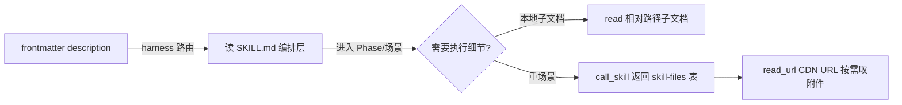
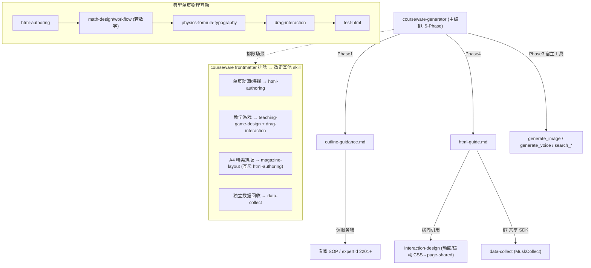
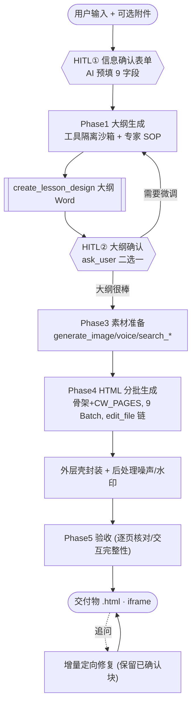

# 飞象「老师」Agent Harness 层架构设计 · 技术实现拆解

> **一句话定义**：飞象「老师」（内部代号 Musk AI Studio）的 Agent Harness 是一套 **「宿主工具 Runtime + 渐进式披露的 Skill 规则集 + 服务端专家 SOP + 云端运行时壳框架」四层协作**的智能体框架。它把不可靠的 LLM 夹在「受约束的输入（Skill 自然语言规则）」与「受约束的输出（`<template>` 内容契约 / SDK 三动词）」之间——**两头收紧、中间放大**；专业度沉到服务端 SOP，运行时稳定性沉到云端壳。
>
> **证据口径**：一手 Skill 实证来自 12 个 Skill（299 个文件）逐版精读，标 **【实证】**；产物逆向来自 grep 4 个 `.inner.html` 样本 + CDP 网络监控 + 交互日志，标 **【逆向推断】**。关键判断处标来源，正文不满篇免责。

---

## 0. 总览：四层架构与数据流

飞象 Skill **没有任何可执行代码**【实证】：每个 `SKILL.md` 顶部是 frontmatter（`name`+`description`，`description` 即 harness 路由依据），正文全是「必须/禁止/⚠️」式规则 + JSON 范例 + 对照表。真正的「执行」发生在三处**别的地方**——宿主 runtime 的 function-calling、服务端 SOP/专家模型、云端壳框架 JS。Skill 只负责**编排这三者并约束 LLM 的产出形态**。

### 0.1 四层架构图（数据流自上而下）

<svg viewBox="0 0 920 600" xmlns="http://www.w3.org/2000/svg" font-family="-apple-system,Segoe UI,Helvetica,Arial,sans-serif">
  <rect x="0" y="0" width="920" height="600" fill="#f7f9fb"/>
  <text x="460" y="30" text-anchor="middle" font-size="18" font-weight="700" fill="#0f2c3f">飞象 Agent Harness · 四层架构</text>

  <rect x="60" y="55" width="640" height="100" rx="10" fill="#e3f2fd" stroke="#1976d2" stroke-width="2"/>
  <text x="80" y="85" font-size="15" font-weight="700" fill="#0d47a1">① 宿主工具 Runtime（design-time 执行器）</text>
  <text x="80" y="110" font-size="12.5" fill="#1f3a4d">LLM + function-calling + agent runner｜create_file / edit_file(不可变写,新 resourceId)</text>
  <text x="80" y="130" font-size="12.5" fill="#1f3a4d">generate_image / generate_voice / search_* / ask_user(HITL) / create_lesson_design / terminate</text>
  <text x="80" y="148" font-size="12" fill="#5a7184">短轮询 executing-status (~80–150ms) 驱动长 workflow 状态机</text>

  <rect x="60" y="180" width="640" height="100" rx="10" fill="#e8f5e9" stroke="#2e7d32" stroke-width="2"/>
  <text x="80" y="210" font-size="15" font-weight="700" fill="#1b5e20">② 渐进式披露的 Skill 规则集（prompt 状态机，非代码）</text>
  <text x="80" y="235" font-size="12.5" fill="#1f3a4d">L0 description(路由,1行) → L1 SKILL.md 正文(编排,~152行) → L2 子文档 read_url(执行,548/939行)</text>
  <text x="80" y="255" font-size="12.5" fill="#1f3a4d">12 个 Skill：编排 / 生成规范 / 学科排版 / 交互组件 / 数据 / 验收</text>
  <text x="80" y="273" font-size="12" fill="#5a7184">可局部覆盖宿主 system prompt：工具隔离沙箱 / 禁并行 / 覆盖 terminate</text>

  <rect x="60" y="305" width="640" height="86" rx="10" fill="#fff3e0" stroke="#ef6c00" stroke-width="2"/>
  <text x="80" y="335" font-size="15" font-weight="700" fill="#e65100">③ 服务端专家 SOP / 知识引擎（黑盒）</text>
  <text x="80" y="360" font-size="12.5" fill="#1f3a4d">insert_courseware_design_sop / consult_courseware_design_expert(expertId 13学科,2201起)</text>
  <text x="80" y="380" font-size="12" fill="#5a7184">课标·教材·学情向量检索；专业度上移，Skill 只定调用约定（单向注入，无学情回流）</text>

  <rect x="60" y="416" width="640" height="100" rx="10" fill="#f3e5f5" stroke="#7b1fa2" stroke-width="2"/>
  <text x="80" y="446" font-size="15" font-weight="700" fill="#4a148c">④ 云端运行时壳框架（runtime 稳定性/交付）</text>
  <text x="80" y="471" font-size="12.5" fill="#1f3a4d">m6azhRVhvHd74GnTkrMdA7.js：翻页/scale/缩略图/saveState·restoreState/MuskCollect 注入(17项)</text>
  <text x="80" y="491" font-size="12.5" fill="#1f3a4d">发布后处理：__SERVER_DATA__/watermark 注入 + 噪声层(真实代码&lt;15%) + Frog 埋点</text>
  <text x="80" y="509" font-size="12" fill="#5a7184">iframe srcdoc 渲染交付物；吸收 LLM 波动；禁 LLM 读改壳 JS</text>

  <defs>
    <marker id="arr" markerWidth="10" markerHeight="10" refX="6" refY="3" orient="auto" markerUnits="strokeWidth">
      <path d="M0,0 L6,3 L0,6 Z" fill="#37474f"/>
    </marker>
  </defs>
  <line x1="380" y1="155" x2="380" y2="178" stroke="#37474f" stroke-width="2" marker-end="url(#arr)"/>
  <line x1="380" y1="280" x2="380" y2="303" stroke="#37474f" stroke-width="2" marker-end="url(#arr)"/>
  <line x1="380" y1="391" x2="380" y2="414" stroke="#37474f" stroke-width="2" marker-end="url(#arr)"/>

  <rect x="720" y="180" width="150" height="336" rx="10" fill="#eceff1" stroke="#607d8b" stroke-width="1.5" stroke-dasharray="5 4"/>
  <text x="795" y="205" text-anchor="middle" font-size="12.5" font-weight="700" fill="#37474f">内容契约（命门）</text>
  <text x="795" y="235" text-anchor="middle" font-size="11" fill="#455a64">&lt;template page-data&gt;</text>
  <text x="795" y="261" text-anchor="middle" font-size="11" fill="#455a64">&lt;template page-shared&gt;</text>
  <text x="795" y="287" text-anchor="middle" font-size="11" fill="#455a64">&lt;!-- CW_PAGES --&gt;</text>
  <text x="795" y="313" text-anchor="middle" font-size="11" fill="#455a64">postMessage</text>
  <text x="795" y="329" text-anchor="middle" font-size="11" fill="#455a64">saveState/restore</text>
  <text x="795" y="355" text-anchor="middle" font-size="11" fill="#455a64">类名白名单</text>
  <text x="795" y="381" text-anchor="middle" font-size="11" fill="#455a64">MuskCollect SDK</text>
  <text x="795" y="420" text-anchor="middle" font-size="10.5" fill="#b71c1c">⚠ 作答数据未被</text>
  <text x="795" y="435" text-anchor="middle" font-size="10.5" fill="#b71c1c">parent 消费 → 开环</text>
  <line x1="700" y1="230" x2="718" y2="230" stroke="#607d8b" stroke-width="1.5" marker-end="url(#arr)"/>
  <line x1="700" y1="430" x2="718" y2="430" stroke="#607d8b" stroke-width="1.5" marker-end="url(#arr)"/>
</svg>

### 0.2 四层职责速览

| 层 | 角色 | 关键载体 | 一句话职责 | 物理位置 |
|---|---|---|---|---|
| ① 宿主 Runtime | 执行器 | function-calling 工具集 + agent runner | 真正干活：建文件、生图、问用户；短轮询驱动多阶段状态机 | 飞象后端 agent runtime |
| ② Skill 规则集 | 大脑/编排 | `SKILL.md` + 子文档（read_url） | 用自然语言把 LLM「编程」成状态机，约束何时调什么工具、产出什么形态 | 注入 LLM 上下文 |
| ③ 服务端 SOP | 专业度 | `insert_*_sop` / `consult_*_expert` | 把教研/命题专业度做成服务端黑盒，Skill 只调不实现 | 飞象服务端知识引擎 |
| ④ 云端壳框架 | 稳定性/交付 | `m6azh….js` + 发布后处理 | 运行期提供翻页/状态/数据 SDK，吸收 LLM 波动；交付 iframe 可运行 HTML | 浏览器 + 发布管线 |

> **核心设计哲学**【实证】（README §二.1）：「窄内容契约 + 平台壳」——只要 LLM 守住中间那道窄接口（`<template>` / postMessage / 三动词），生成质量的波动就被壳框架吸收；模型不需要、也被禁止理解壳的实现。

---

## 1. 第一层 · 宿主工具 Runtime

宿主 runtime 是真正的执行器：Skill 通过 prompt 编排它来「干活」。它提供工具集、function-calling 协议、agent runner（状态机驱动）三块基础设施。

### 1.1 工具集全景（按类别）

| 类别 | 工具 | 关键约定 |
|---|---|---|
| 文件 | `create_file`、`edit_file` | **不可变写**：每次产生新 `resourceId`，原文件保留 |
| 素材 | `generate_image`、`generate_voice`、`search_web`、`search_papers`、`search_knowledge` | 图片/语音**必须 URL，禁 base64**（courseware §3.2.2） |
| 大纲专用 | `insert_courseware_design_sop`、`consult_courseware_design_expert`、`create_lesson_design`、`process_content_show` | 仅 Phase 1 工具隔离期可用 |
| 交互/确认 | `ask_user`、`terminate` | HITL；terminate 可被 skill 覆盖不执行 |
| 数据闭环 | `create_instance`、`publish_resource`、`bind_resources` | publish 单独一轮、用最新 resourceId、禁与 create 并行 |

### 1.2 function-calling 协议演进（文本 `call:` → 原生 tool_call）【实证】

| 版本 | 协议 | 含义 |
|---|---|---|
| 早期（outline v15） | 文本 `call:` 模拟工具调用（=7 处） | harness 早期用「文本约定」让 LLM 表达工具意图，再由外层解析 |
| 后期（outline v16） | 标准 `tool_call`（=8 处） | 接入原生 function-calling，结构化、更稳、可校验 |

这条演进说明 harness 的工具调用层从「prompt 文本协议」升级到了「平台原生 function-calling」，是稳定性的关键拐点。

### 1.3 `edit_file` 不可变写 + resourceId 链式追踪（底层约定）

`edit_file` 是 **immutable write**【实证】：每次编辑生成新文件、新 `resourceId`，原文件保留。这迫使整条流水线采用 **resourceId 链式追踪**：

- courseware `html-guide §9.4`：分批注入每批 `edit_file` 后必须刷新「最新 resourceId」，下一批基于它继续。
- data-collect §核心规则 10：`publish_resource` 必须用**最新** resourceId，且**不能与 create/edit 同轮并行**（否则发布的是旧版）。

> 这是影响所有「分批生成」「发布可见」模式的运行时地基——分批、追问修复、发布，全部建立在「资源版本链」之上。

### 1.4 HITL 工具的演进（倒计时自动确认 → 结构化 ask_user）【实证】

| 阶段 | 工具 | 形态 |
|---|---|---|
| v1 | `continue_ask` | 带**倒计时自动确认**——「趁用户在场先确认，确认不阻塞」 |
| v18 | `ask_user` | 单选/多选 + 预填 + `allowCustomAnswer`，把确认变成「点一下即可」 |

大纲确认用固定二选项（「大纲很棒，直接开始制作 / 需要微调」），`allowCustomAnswer=False` 收口（courseware §Phase 2）；data-collect 用三题多选确认是否接入数据回收。

### 1.5 agent runner：短轮询驱动长 workflow【实证】

宿主 runner 用 HTTP **短轮询**（非 SSE/WebSocket）拉取多阶段状态机进度：

| 项 | 值 |
|---|---|
| 端点 | `/musk-ai-studio/api/agent-chat/executing-status` |
| 频率 | ~80–150ms/次（≈7–12 QPS/活跃用户） |
| 呈现 | 文字**整块出现**，非逐字流式 |

> 选型逻辑【推断】：分钟级长 workflow 下 SSE 网关超时/缓冲/状态恢复复杂，短轮询无状态、易水平扩展。代价是高频请求；瓶颈推断在同时活跃生成 >5000–10k 时需降频/长轮询/WS。

---

## 2. 第二层 · 渐进式披露的 Skill 规则集

### 2.1 本质：用自然语言写的状态机

`SKILL.md` 是一台**用自然语言写的状态机**：frontmatter 做路由，正文用带前置条件的 Phase 做状态转移，靠「必须/禁止/⚠️」约束 LLM 行为，靠对工具的引用来「驱动」宿主执行。最强的一个事实是：**Skill 规则有权局部改写宿主 system prompt 的全局规则**（见 §2.6）。

### 2.2 三层渐进式披露（Progressive Disclosure）

| 层级 | 文件 | 何时进入 LLM 上下文 | 体量 | 证据 |
|---|---|---|---|---|
| L0 发现层 | `SKILL.md` frontmatter `description` | 常驻/路由时 | 1 行 | v18/SKILL.md frontmatter |
| L1 编排层 | `SKILL.md` 正文（5-Phase 导航） | 命中 skill 时 | ~152 行 | v18/SKILL.md L16–22 |
| L2 执行层 | `outline-guidance.md` | 进入 Phase 1 才读 | ~548 行 | 正文相对路径链接 |
| L2 执行层 | `html-guide.md` | 进入 Phase 4 才读 | ~939 行 | 正文相对路径链接 |

**关键机制**【实证】：子文档**不写进 frontmatter**，而是用正文里的相对路径 Markdown 链接引用——harness 把 `SKILL.md` 当索引、子文档当「延迟加载的章节」。**Token 账**：三层 ~1640 行若一次性灌入极浪费；渐进式披露把它摊到流程时间轴上——路由只读 1 行，命中读 152 行，干到某 Phase 才付 548/939 行代价。

> **按复杂度自适应**：data-collect 走单文件形态（v13 仅 249 行，无子文档），因为流程短、规则能压进一个文件。简单 skill 不强行拆分。

### 2.3 `<skill-content>` / `<skill-files>` 平台部署形态

| 形态 | 含义 | 进入方式 | 证据 |
|---|---|---|---|
| `<skill-content>` | 包裹 SKILL 正文 | 内联进 system prompt | `html-authoring/SKILL_v5_主文档.md`；`teaching-game-design/SKILL_v1.md` vs `v1/SKILL.md` 仅差此包裹=平台打包痕迹 |
| `<skill-files>` | 列 {文件路径 \| CDN URL} 清单 | 运行时按需 `read_url` | `html-authoring/SKILL_v5_主文档.md` 末尾列 8 附件 CDN URL |

**硬规则**【实证】（`html-authoring/v5/math-design/workflow.md` L87–88）：「**必须使用 `call_skill` 返回的 `<skill-files>` 表中 CDN URL 原样 `read_url`，禁止自行拼接路径**」。原因：平台打包会**路径扁平化**（`math-design/workflow.md` → `v5/workflow.md`），硬编码路径会失效。

> **发布管线滞后风险**：`courseware-generator/SKILL_v18_CDN.md` 与本地 v18 逐字节相同；但 `data-collect/SKILL_v1_CDN.md` 线上仍是 v1（本地已迭代到 v13）——多 skill 线上版本未对齐，迭代意图只能靠 diff 反推。

### 2.4 加载链路与 read_url 纪律



| 场景 | read_url 读什么 | 纪律 | 证据 |
|---|---|---|---|
| html-authoring 数学子链路 | workflow / color-palettes-a·b / grid-templates | 原样 CDN URL | `SKILL_v5_主文档.md` `<skill-files>` |
| test-html 写断言 | `references/test-templates.md` | 主干 116 行 + 按需 | test-html/v3 L8–9 |
| magazine-layout | 九件套（reproduction-guide / mineru-integration…） | Phase 1/3/4 分阶段强制 read | magazine/v9 L59–71 |
| paper-generation | Guardian 素材 | 返回后**禁止**再 read_url | 07 报告 §1.4 |

### 2.5 5-Phase 状态机：前置条件 + 控制权交接 + 工具隔离沙箱

**（1）带前置条件的状态转移**【实证】（v18/SKILL.md L64）：
> 「⚠️ 前置条件：Phase 2 的入口条件是 Phase 1 已成功调用 `create_lesson_design` 生成了大纲文件。如果大纲文件尚未生成，禁止进入 Phase 2。」

**（2）子流程「交还控制权」+ 覆盖 terminate**【实证】（v18/SKILL.md L58）：
> 「outline-guidance.md 原始流程中的 `terminate` 调用在本技能中**不执行**…直接进入 Phase 2，不终止任务。」

含义：outline-guidance 原本是能独立运行（含 terminate）的**子智能体流程**，被主编排嵌入后，靠 prompt 覆盖其终止行为，**降级为一个 Phase**——典型的「子 agent 被编排为步骤」。

**（3）工具隔离 = 子流程沙箱**【实证】（outline-guidance.md L9–15）：
> 「Phase 1 期间仅允许调用『可用工具概览』中列出的工具，不得调用宿主 system prompt 中的其他工具（如 create_file、edit_file、generate_image…）。唯一例外：流程全部完成（已调用 create_lesson_design）后控制权交还宿主。」

并**覆盖宿主并行调用规则**，强制串行（「本规则覆盖宿主 system prompt 中『多个工具并行调用』的规则」）。

### 2.6 调度 / 互斥 / 优先级

**（A）Skill 覆盖宿主规则**——优先级「Skill 规则 > 宿主默认规则」，显式声明、带边界（工具可用集、并行/串行、terminate，见 §2.5）。

**（B）magazine-layout 冲突屏蔽（最强互斥，原文证据）**【实证】（`magazine-layout/v9/SKILL.md`）：
- **L45**：「本任务只使用 magazine-layout 作为主 Skill；**禁止**再调用 mathdesign-1-html、html-authoring、page-optimize、mathdesign-*…**即使其他 Skill 描述里写了『强制执行』，在精美排版/A4/PDF 保真场景也必须忽略**」。
- **L77–78**：「单一入口…」「**冲突屏蔽**：mathdesign-1-html 面向数学互动/课件视觉…若规则冲突，**一律以本 Skill 为准**」。
- frontmatter 自称「精美排版唯一主 Skill」。

**（C）其他互斥 / 边界**：

| 冲突对 | 规则 | 证据 |
|---|---|---|
| courseware vs 单页/排版/游戏 | frontmatter「不适用于教学动画、教学游戏、单页动画、精美排版」 | v18/SKILL.md frontmatter |
| math-design vs 多页 | 排除多页 PPT → 转 courseware-generator | 05 报告 §3 |
| teaching-game vs drag-interaction | 游戏建议 mouse+touch 双绑；drag-interaction **禁双绑**、要求 Pointer Events | 09/12 报告 |
| stroke-order vs stroke-animation | 字表 **2842 vs 2865** 教材字不同步 | 10/11 报告 |
| 公式分隔符 | paper `$...$` vs html/physics `\(...\)` `\[...\]` | 03/06/07 报告 |
| html-authoring 学科路由 | 数学首行 `<!-- html-authoring:math-design … -->` 必读 math-design；**非数学学科前缀最高优先级**，即使含「互动课件」也禁 read math-design，首行 `<!DOCTYPE html>` | html-authoring/v5 §第0步 |

---

## 3. 第三层 · 服务端专家 SOP / 知识引擎

把「教研/命题专业度」从 prompt 上移到服务端黑盒；Skill 只定义调用约定（expertId、task、SOP 插入），不实现专业逻辑。

| 工具 | 作用 | 关键约定 | 证据 |
|---|---|---|---|
| `insert_courseware_design_sop` | 取「课件大纲任务操作规范」 | 返回 `expertId`（13 个学科分支，2201 起）；**禁止模型自编 expertId** | outline-guidance.md L31–32、L108–136 |
| `consult_courseware_design_expert` | 专家推理 | 参数 `expertId`（原样传入）+ `expertTask`（如「关键词提取」） | outline-guidance.md |
| `insert_sop` / `consult_expert`（paper） | 命题专项 SOP + 专家咨询 | 含材料/情境/阅读→立即 `insert_sop` 严格执行；`consult_expert` task：主题适配/超纲词/干扰项 | paper-generation/v1 |
| `detect_beyond_words`（paper） | 超纲词检测 | 命题合规门 | paper-generation/v1 |

**专业度上移的证据**【实证】：courseware v13→v14 **删掉 3 个专项搜索工具**（教参/素养教案/物理教学指导），搜索收敛到课标/教材/web/知识点 4 个——专业推理从「多个专项检索工具」上移到服务端专家 SOP。

> **架构特征**：SOP 是**单向注入**——把专业上下文喂给生成，但**没有学情回流**（产物侧无作答数据回到 SOP 反哺，见 §10.2）。专家思考在产品上表现为「~2000 字的折叠卡片」（课标/教材检索/精选资源 PDF 外链/逐页设计表）。

---

## 4. 第四层 · 云端运行时壳框架

生成期 LLM 只写 `<template>` 片段；运行期由云端 JS 提供「壳」，吸收 LLM 方差并交付可运行 HTML。

### 4.1 壳框架 JS 与 17 项能力【实证】

- 生产地址：`musk-online.fbcontent.cn/.../m6azhRVhvHd74GnTkrMdA7.js`（v15 起为生产，v14 前是 `musk-test`；v1 最早壳为 `NBhSGcztvPnQBj9cbEdkBe.js`）——**版本目录能反推上线时点**。
- 壳框架在浏览器里包办 17 项能力（html-guide §八 L591–609）：缩略图侧栏、960×540 scale 三态适配、演示模式、键盘/滚轮/点击翻页、焦点管理、`saveState`/`restoreState`、自动注入 base CSS、把 `<template>` 包装成完整 iframe 文档、注入 `MuskCollect` SDK 类、注入 `window.__CW_MODE__` 等。
- **硬约束**：「禁止读取/修改壳 JS」「禁止手写壳 CSS/JS」（html-guide §一 L27、§十二）。

### 4.2 内容契约（生成期 ↔ 运行期的接缝，命门）

| 契约 | 含义 | 出处 |
|---|---|---|
| `<template class="page-data" data-id data-name>` | 一页课件 | html-guide §3.2 |
| `<template class="page-shared">` | 全页共享 `<head>` 资源（唯一 `:root` 设计令牌） | html-guide §3.4 |
| `<!-- CW_PAGES -->` | 18 字符增量注入锚点 | html-guide §9.2 |
| `postMessage {type:'saveState', state}` | 页 → 壳 状态上报 | html-guide §6.1 L332 |
| `postMessage {type:'restoreState', state}` | 壳 → 页 状态恢复 | html-guide §6.2 L344 |
| `.dragging` / `data-dragging` | 拖拽中标记，壳检测后**阻止翻页** | html-guide §6.3 L397–411 |
| 禁 ↑↓←→/空格作交互 | 壳放映模式拦截用于翻页 | html-guide 禁止清单 L695、L931 |
| `new MuskCollect()` | 数据 SDK 实例（壳只注入类） | html-guide §7 L460–490 |
| `window.__CW_MODE__==='thumbnail'` | 缩略图守卫，禁 save | html-guide §7 L494–508 |

> 这条接缝是整个 harness 的命门：**只要 LLM 守住这个窄接口，生成质量的波动就被壳框架吸收**。

### 4.3 事件拦截（翻页 vs 交互冲突）【实证】

壳在放映模式下把 ↑↓←→/空格用于翻页，因此 skill **禁止**页面用这些键作交互；拖拽时页面加 `.dragging`，壳检测到后**阻止翻页**——这是「踩过的坑固化成规则」的典型（误翻页事故）。

### 4.4 发布后处理：注入 + 噪声 + 埋点 + iframe 封装

发布管线在生成 HTML 之后做一层「后处理」，对 LLM 不可见：

| 机制 | 细节 | 证据 |
|---|---|---|
| `__SERVER_DATA__` 注入 | 外层壳 `feixiang-musk-courseware.html` 172–177 行注入 `watermarkChatId`(会话绑定)/`watermarkEnv`/`watermarkBizId`(多租户)/`watermarkUrl` | 【实证】 |
| iframe srcdoc 容器 | `<iframe class="content-iframe" srcdoc="…整份 HTML(实体编码)">`（274 行）；预览 `musk-html-preview-iframe`(`sandbox="allow-scripts allow-same-origin"`)；缩略 `musk-html-thumbnail-iframe` | 【实证】 |
| 离线重定向 | `file://` 打开自动跳 `watermarkUrl` 在线地址（181–198 行） | 【实证】 |
| 品牌水印 | `.watermark-overlay`（logo + feixianglaoshi.com +「立即体验」）；`<meta name="generation-source" content="AI生成">` | 【实证】 |
| 噪声层 | 注入伪 Webpack 5.88.2 / WCAG 2.1 AA / 假 GA4 `data-measurement-id` / feature-flags / CMS Sync / 离屏 `Marker-xxxx`(left:-9999px)；**真实代码 <15%**（4561–5485 行有效 vs 头尾噪声） | 【实证】inner.html |
| Frog 埋点 | `use_time`(eventId **42818**) / logo(**42816**) / 立即体验(**42817**)；`customExtend.chat_id`+`use_time` 秒；全页点击埋点 eventId **50004** 整段**注释未启用**（7823–7854 行） | 【实证】 |

---

## 5. 全 Skill 地图与协作

### 5.1 12 个 Skill 按角色归类

| 角色 | Skill | 职责（一两句） | 版本 / CDN | 关键路径 |
|---|---|---|---|---|
| **编排** | courseware-generator | 互动课件端到端 5-Phase；**唯一**多页 PPT 式主编排 | v1–v18，CDN=v18 | `courseware-generator/v18/SKILL.md` |
| **编排** | paper-generation | 出题/组卷工具编排：意图→模式 A–F→搜索筛选→`create_question_sheet/paper` 收口 | v1 | `paper-generation/v1/SKILL.md` |
| **生成规范** | html-authoring | 单页交互 HTML 硬契约：DoD、spec 注释、学科路由、CDN/媒体白名单、机械抽选 | v1–v5 | `html-authoring/v5/SKILL.md` |
| **生成规范** | teaching-game-design | 教学游戏架构：GamePhase 状态机、单向数据流、心流难度、反馈系统（无代码模板） | v1 | `teaching-game-design/v1/SKILL.md` |
| **学科排版** | magazine-layout | A4/PDF 保真 + 美化双目标；MinerU 素材包；发布前断路器 + guard CLI | v1–v9（内称 v31） | `magazine-layout/v9/SKILL.md` |
| **学科排版** | math-design | 数学视觉独立快照（色板/字号/视觉冲击）；已被 html-authoring 收编为子目录 | 独立 9 文件 | `math-design/SKILL_v1.md` |
| **学科排版** | physics-formula-typography | 物理公式 MathJax3 横切：语义角标、动态 typeset、Canvas 禁画公式、10 项自检 | v1.4.0 | `physics-formula-typography/v1/SKILL.md` |
| **交互组件** | drag-interaction | 四模板路由（A/B/C-1/C-2）+ 17 项必检；Sortable 优先 | v1 | `drag-interaction/v1/SKILL.md` |
| **交互组件** | stroke-animation | 笔顺动画/跟练：`animate()` 观看 vs `mount()` DTW 评分；2,865 教材字 | v1.7.5 | `stroke-animation/v1/SKILL.md` |
| **交互组件** | stroke-order | 笔顺数据层：`getStrokeData`、`<stroke-card>` Web Component、7818 字/tier | v11.7 | `stroke-order/v1/SKILL.md` |
| **数据** | data-collect | 纯前端→后端：MuskCollect `save/query/delete`；收集页 + 报告页；联通性自检 | v1–v13，CDN=v1 | `data-collect/v13/SKILL.md` |
| **验收** | test-html | Playwright `test_html`：must-cover 清单、spec 播种、核心闭环/可达性硬门 | v1–v3，CDN=v3 | `test-html/v3/SKILL.md` |

> 注：courseware 还引用 harness 外的 `interaction-design`（不在本批 12 skill 目录内）。

### 5.2 主编排如何串起所有 Skill（调用关系图）



---

## 6. 工具链清单（跨层汇总）

| 工具 / 机制 | 用途 | 调用方式 | 所在层 | 出处 |
|---|---|---|---|---|
| `read_url` | 按需加载 skill 附件 | `call_skill` 返回 `<skill-files>` CDN URL→`read_url`，禁自拼 | ①+② | workflow.md L87–88 |
| `read_file` | 读用户上传 / spec_ref | outline 读教案；test-html 读 spec_ref | ① | test-html/v3 L49–50 |
| `test_html` | Playwright 云函数单测 HTML | 传 `resourceId`+`playwrightCode`；顶部 `# must-cover:`；60s/20s 等待预算 | ①QA | test-html/v3 L17–53 |
| test_html 断言模板 | 渲染/响应式/LaTeX/交互/约束/闭环/可达性 | 组合 `references/test-templates.md` | QA+生成规范 | test-html/v3 L55–69 |
| **MuskCollect 三动词** | 跨用户数据持久化 | `new MuskCollect()`→`save(collection,data)` / `query(collection)` / `delete(collection,docId)` | ④SDK + data-collect | data-collect/v13 L167–169；html-guide §7 L460 |
| `create_instance` | 创建数据活动空间 | 返回 `instanceId` | ①+data-collect | data-collect/v13 |
| `publish_resource` | 用户可见性唯一入口 | 单独一轮、用最新 resourceId；禁与 create/edit 同轮 | ①+data-collect | data-collect/v13 L80–86,L208 |
| `bind_resources` | 页面↔instance 数据通道 | 一次性注册 `role=collect/report` | ①+data-collect | data-collect/v13 L88,L208 |
| **MinerU 素材包合同** | PDF/DOCX→结构化 JSON | 后端标准化 `questions[]/figures[]/tables[]/quality{}`，Agent 不视觉猜版 | ③上游 + magazine | mineru-integration.md L37–78 |
| **magazine-layout-guard CLI** | 发布前机检题量/真图/MathJax | `npm run check -- --input result.html --min-questions 30 --require-real-images --require-mathjax --json`；exit≠0 禁发布 | 工程门禁 | quality-gate.md L28–43 |
| 发布前断路器（v31） | `create_file` 之前熔断 | 缺 MinerU/题内图/预计 img=0 → 禁 create_file + 统一阻塞话术 | ②magazine 规则 | magazine/v9 L27–43 |
| **codepoint 哈希机械抽选** | 抗配色/布局同质化 | `hash=ord(kw[0])×7+ord(kw[-1])×5+len(prompt)`；`palette_id=X-{(hash mod N)+1:02d}`；layout `(ord(kw[0])+len(prompt)) mod 3` | ②html-authoring | html-authoring/v5 L120 |
| **window.__math3d 探针** | 3D 场景可机检 | 暴露 `.ground`/`.grid`；opacity/aspect/polarAngle 硬阈值 | 产物 + test_html | html-authoring/v5 L126,L150 |
| spec 注释 | 生成端写契约、验收端读 | `<!-- spec: requirements=…; forbid=…; require=…; count=…; core-loop=… -->` | ②→QA | html-authoring/v5 L84–89 |
| **壳框架事件拦截** | 翻页 vs 交互冲突 | 禁 ↑↓←→/空格作交互；拖拽加 `.dragging` 阻翻页 | ④壳 JS | html-guide §6.3 L397,L695 |
| **postMessage 协议** | 页↔壳状态（+缺失的数据外发） | `{type:'saveState'/'restoreState',state}` | ④壳 | html-guide §6.1–6.2 L332–344 |
| `generate_image`（文生图） | 情境图/配图 | Phase 3 并行；magazine 仅语言类阅读氛围图且标「AI 配图」 | ① | courseware v18 §Phase3 |
| `generate_voice` | TTS 音频 | 必须 URL，禁 base64 | ① | courseware v18 §3.2.2 |
| **CDN 库白名单** | 防幻觉库/CORS | v2 起 CDN URL 外移 system prompt「外部库白名单」；skill 只管注入位置 | system prompt + ② | 03 报告 §2.2 |
| MathJax3 自托管 | 公式渲染 | `blER0Bn7vsa2JER9IEssf8.js`；`\(...\)` `\[...\]` | physics+html-authoring+magazine | physics v1 铁律1 |
| Paged.js 0.4.3 | A4 打印分页 | MathJax config→tex-svg→PagedConfig.before→Paged polyfill | magazine | 04 报告 §3.4 |
| `create_lesson_design` | 大纲 Word 交付物 | Phase 1 终点 / Phase 2 入口条件 | ①+outline | v18/SKILL.md L31–64 |
| `ask_user`（HITL） | 结构化确认 | Phase 2 固定二选一；data-collect 三题多选；`allowCustomAnswer` | ① | v18/SKILL L68–71 |
| formula_typography_self_check | 物理公式 10 项 JSON 自检 | 任一失败不交付，最多 2 轮补丁 | ②physics | physics v1 铁律9 |

> **作答数据外发缺口**【实证 + 逆向推断】：drag / stroke / game 三类交互 skill **均无 postMessage 上报作答的约定**；README §二.3 指出最佳埋点应是 drag `onAdd/onEnd`、stroke `onStrokeComplete/onFinish`、game `updateState`——但产品路径未闭合（见 §10.2）。

---

## 7. 生成流水线全景：courseware-generator 5-Phase

### 7.1 实测锚点【实证】

> 上传 **71.5KB 九年级物理复习 Word** → 输出 **20 页课件**；全程 **8+ 阶段、2 个 HITL 门控、9 个 Batch 串行**；复杂度评估为 **4 强互动 + 16 普通**。

### 7.2 流程图（Phase1→Phase5 + 两个 HITL）



### 7.3 逐阶段表（产品 UI ↔ 后端 ↔ skill/工具）

| 阶段 | 产品 UI 表现 | 后端动作 | skill / 工具 | HITL | 证据 |
|---|---|---|---|---|---|
| ① 意图&教学设计 | 后台（未单独展示） | 解析需求/附件（附件=第一权威） | outline-guidance | — | 【推断】 |
| ② 信息确认表单 | AI 预填：年级/册次/教材版本/教学重点(默认全选)/课时数等 | Skill 结构化输出 + 预填 | `ask_user` / 结构化字段 | **HITL①** →「已确认」标签 | 【实证】交互日志 |
| ③ 专家思考 | 折叠卡：🔍关键词→📖课标→📚教材检索(无资料橙告警)→📖精选资源(PDF外链)→逐页设计表，~2000 字 | `insert_courseware_design_sop` / `consult_courseware_design_expert(expertId)` | 服务端 SOP | — | 【实证】UI + 【推断】工具 |
| ④ 大纲/分页规划 | 20 页逐页：页码/类型/教学内容/活动/交互方案 | 逐页大纲 → `create_lesson_design` | outline-guidance | — | 【实证】日志 + 产物 `data-name` |
| 〔Phase2〕大纲确认 | 大纲卡片 + 二选一按钮 | 前置硬门控：必须已有 create_lesson_design | `ask_user`（allowCustomAnswer=False） | **HITL②** | v18/SKILL.md L62–84 |
| ⑤ 图片生成 | （进度内） | 8 张英文 prompt 文生图 | `generate_image` 并行 | — | 【推断】日志 |
| ⑥ 复杂度评估 | 生成计划：4 强互动 + 16 普通；强互动页额外「交互剧本」 | 强互动页独占批次；普通页打包 | html-guide §8–9 | — | 【实证】UI + 产物 |
| ⑦ 分批串行生成 | 9 条进度行 🔄→✓ 逐条变绿 | 骨架 `create_file`(meta/page-shared/CW_PAGES/壳JS) → 每批 `edit_file` 在 `<!-- CW_PAGES -->` 前插 `<template page-data>`，刷新最新 resourceId | html-guide + interaction-design | — | 【实证】UI + 源码 |
| ⑧ 素材回填 | 合并在 Batch 进度中 | 强互动页批内补 generate_image/voice | 宿主工具 | — | 【推断】 |
| ⑨ 互动/状态装配 | （产物层） | 页内 `saveState`/`restoreState`；拖拽 `.dragging`；可选 `new MuskCollect()` | html-guide §6–7 | — | 【实证】源码 |
| ⑩ 后处理噪声/水印 | 用户不可见 | 注入伪 Webpack/WCAG/假 GA4/Marker 离屏水印（真实代码 <15%） | 发布后处理流水线 | — | 【实证】inner.html |
| ⑪ 外层壳封装 | 交付物卡片：HTML 图标 + 文件名 + 缩略图 + ↓下载 | iframe srcdoc + `__SERVER_DATA__`/watermark + Frog 埋点 | 云端壳 | — | 【实证】 |
| ⑫ 追问增量修复 | 绿色追问卡 → 修复摘要 3 条 → 新版交付物 | `edit_file` 增量替换目标段 → 新 resourceId | 宿主工具 | — | 【实证】 |

### 7.4 两个 HITL 门控

| 门控 | 位置 | UI 形态 | 产品意图 | 关键约束 |
|---|---|---|---|---|
| **HITL①** 参数确认 | 信息确认阶段 | 结构化表单 + AI 预填 +「已确认」标签 | 教师从「输入者」变「确认者」，降废稿 | 字段默认全选/预填 |
| **HITL②** 大纲确认 | Phase 2 | 逐页设计表审阅 + 二选一/补充需求 | 掌控方向；简单任务可走快通道跳过【推断】 | 前置必须有 `create_lesson_design`；`allowCustomAnswer=False` |

### 7.5 流水线背后的运行时约定

- **`edit_file` 不可变写** → resourceId 链式追踪（见 §1.3）。
- **分批策略**【实证】：强互动页 **1 Batch/页**（拿满 token），普通页 **2–4 页/Batch**；UI 用 9 条独立进度行反「等待焦虑」，并提前披露「第 N 页强互动」做质量预期管理。
- **复杂度路由**【实证 + 推断】：简单单页 → 单次 LLM 快通道；复杂多页 → 完整 8+ 阶段 workflow；置顶任务命名（「Agent 自主规划/调用」vs「工作流生成」）直接暴露 Agent 与 Workflow 双范式。

---

## 8. 产品侧表现与路由（映射回四层）

### 8.1 featureId 与工具路由

| featureId | 产品入口 | 路由形态 | 映射层 |
|---|---|---|---|
| **20** | AI 互动课件 | `#/home?featureId=20`，资源广场默认页 | ②Skill 配置 + ④壳 |
| **17** | AI 命题 | 对话页顶部 Tab | ②Skill 配置 |
| **18** | AI 组题 | 同上 | ②Skill 配置 |
| **19** | AI 教案·大单元 | 同上 | ②Skill 配置 |

- 17/18/19 **共享同一对话壳 + 左侧栏**，差异在示例提示词与后端 Skill 配置【推断】——「一个壳、多个能力」。
- 内部代号 **Musk AI Studio**（`pub-musk-ai-studio`）；前端 CDN 代号 **Metis**（`metis-online.fbcontent.cn`）【实证】。
- 提交：`POST /musk-ai-studio/api/agent-chat/...`，body 含 `featureId/prompt/attachments/params`【推断】。

### 8.2 「对话即应用」UI（映射 ①宿主 runner）

| UI 元素 | 内容 | 映射 |
|---|---|---|
| 左侧栏 ~240px | +新建任务 / 4 工具 / 置顶·今日·历史任务（27+ 条，含大量「改编《…》」）/ 剩余积分（实勘 54）+ 用户名 | 会话即文档持久化 |
| 创作流 | 信息确认表单→专家思考折叠卡→生成计划→分批进度🔄→✓→交付物卡→AI 说明→追问修复 | ①runner 驱动多阶段状态机 |
| 历史任务 | 以标题为索引常驻，点击回到对话继续追问 | 对话历史即版本（无资源库级 diff/协作）【推断】 |

### 8.3 资源广场 / 改编 / 积分计费

| 模块 | 表现 | 映射/推断 |
|---|---|---|
| 资源广场 | 12 学科 Tab + 教材版本×年级×学期二级筛选；卡片瀑布 4 列；顶部 4 能力（教学动画/游戏/互动课件/数据回收）；双指标 6.5万/6506 | 大=浏览、小=收藏【推断】；接口 `GET /api/resource/list?subject&grade&semester`、`/api/resource/:id`【推断】 |
| 改编飞轮 | 历史任务「改编《…》」≈「生成…」；TeacherYO 官方 PGC 浏览 6000~6.5 万 | PGC 示范→浏览→改编→UGC 沉淀→广场密度↑【推断】 |
| 积分计费 | 实勘「剩余积分：54」 | 已商业化，按次计量（非订阅）【推断】 |

---

## 9. 质量约束与反噪音机制（harness 级模式）

飞象用一套**可复用的质量模式**对抗 LLM 不稳定，跨多个 skill 反复出现：

| # | 模式 | 做法 | 证据 |
|---|---|---|---|
| 1 | HITL 结构化、不阻塞 | `continue_ask` 倒计时自动确认 → `ask_user` 单/多选 + 预填 + `allowCustomAnswer` | courseware §Phase2 |
| 2 | 先产「可读中间物」再大力生成 | 先出大纲、强互动页先出「五维度交互剧本」、数据页先出「联通性自检对照表」 | 多 skill |
| 3 | 预算化防溢出 | html-guide §4.5–4.9 把 960×540 画布换算成字数/元素上限 + 特殊元素扣减表 | html-guide |
| 4 | 分批 + 锚点注入 + 串行 resourceId | 骨架 + `<!-- CW_PAGES -->`，强互动页独占批次，普通页打包，逐批刷新 resourceId | html-guide §9 |
| 5 | 静态自检表 + 硬门禁 | data-collect 联通性自检【硬约束】：未输出对照表/仍有 ✗ 就 publish = 违规；magazine guard CLI exit≠0 禁发布；发布前断路器 | data-collect / magazine |
| 6 | 反噪音 / 脱敏 | 大纲禁出现内部工具名（用「AI 语音朗读」代替 `generate_voice`）；禁向用户暴露 resourceId/分批策略 | outline §8、html-guide §10.4 |
| 7 | 失败防御源自线上事故 | `if (window.muskCollect)` 反例（小写驼峰永远 undefined→save 静默失败）、缩略图守卫、时间戳 `Number()` 转换、拖拽 `.dragging` 防误翻页 | data-collect / html-guide |
| 8 | 机械抽选抗同质化 | codepoint 哈希选 palette/layout（见 §6） | html-authoring/v5 L120 |
| 9 | 探针 + 断言闭环 | spec 注释 + `__math3d` 探针写契约 → test_html 读断言 | html-authoring ↔ test-html |

---

## 10. 逆向倒推的关键判断（产物逆向推断）

> 以下结论以 grep 4 个 `.inner.html` 样本（courseware/s2/s3/s4）+ CDP + 交互日志为依据，统一标 **【逆向推断】**，关键支撑给【实证】片段。

### 10.1 软规范 vs 硬外壳

| 硬外壳（跨样本一致，工程化资产） | 软规范（跨样本各异，Prompt 约束） |
|---|---|
| `metis-misc/zgLDUdmazTYc0B4K6Cor.js`、`zZZY40t7WJC7UdQCPACm.js`、`blER0Bn7vsa2JER9IEssf8.js` 同组 CDN 库 | 内层 DOM/CSS/JS **零代码复用**，每页手写互动 |
| 外层 iframe 宿主 + Frog 埋点结构 | 设计令牌**名**一致、**值**由 LLM 现场决定 |
| 后处理噪声层成体系（WCAG/Webpack/GA4/Marker） | 栅格版式行内 `style` 即兴，无抽象栅格类 |
| CSP img/media 白名单（fbcontent/aliyuncs/googleapis） | 壳类名白名单（`.tool-btn/.drag-item/.option-btn`）靠约定，可被 LLM 遗漏 |
| `user/upload/admin/m6azhRVhvHd74GnTkrMdA7.js` 壳运行时 | 同名 `saveState()` 每页各写一份，靠 `<template>` 隔离作用域 |

**依据**【实证 grep】：四样本 `--primary` 分别 `#3B82F6 / #2563EB / #01553D / #D7F324`；共享库文件名完全一致；互动实现逐页不同。
**推论**：飞象能「演示任意互动」，但天然无法做结构化作答采集、版本语义 diff、自动化质检——**架构起点分叉，非疏漏**。

### 10.2 开环数据：作答断流根因

> **根因 = 各交互 skill 把交互算全了，但没有 postMessage 外发数据被宿主消费**，而非「忘了写 postMessage」。

| 链条 | 证据 |
|---|---|
| 页内已实现交互逻辑 | `checkQ7(btn,isCorrect)` / `testCircuit()` / `handleDrop()`【实证】 |
| 页内已上抛 | `window.parent.postMessage({type:'saveState', state}, '*')`（4799/4923/5149/5320 行）【实证】 |
| state 逐页自定 | `{mode}` / `{currentStroke}` / `{items}` / `{correctCount}`【实证】 |
| 外层壳 Frog 只报 | `use_time`(42818) / logo(42816) / 立即体验(42817)；点击埋点 50004 注释未启用【实证】 |
| 外层壳无消费 | 搜不到 `saveState` 消费逻辑【实证】 |

**间接证据**：停留时长用 `visibilitychange/blur/focus/beforeunload/pagehide`+100ms 防抖精细累加——**有能力精细采数却零作答采集 → 战略选择开环**。
**与 Skill 层矛盾**：存在 data-collect skill + MuskCollect 契约（create_instance/publish_resource/bind_resources），但实测物理样本 parent 不消费 → 生成规范与运行态闭环**未在产品路径闭合**。

### 10.3 设计令牌跨样本各异

| 维度 | 事实 | 证据 |
|---|---|---|
| 令牌名 | 7 变量固定 `--primary/--secondary/--accent/--bg/--text/--success/--error`（page-shared 唯一 `:root`） | 【实证】 |
| 令牌值 | 四样本 primary 四色各异 | 【实证 grep】 |
| 旁路 | 反馈色写死 hex（正确 `#dcfce7/#22c55e`、错误 `#fee2e2/#ef4444`），未复用 `--success/--error`（4954–4964 行） | 【实证】 |
| 响应式 | 内层全固定 px，无 rem/vw/@media；自适应靠外层 100vw/vh + 移动端 375 设计稿 `adjustRem()` | 【实证】 |

**推断**：令牌是 **Skill 提示词级软约束**，非编译期主题系统 → 跨版本 Prompt/LLM 升级可致风格漂移，无法批量回滚。

### 10.4 反噪音 vs 加噪音的矛盾

| 阶段 | 方向 | 规则 | 证据 |
|---|---|---|---|
| 生成期（Skill） | **反噪音** | 禁 AI 幻觉 build marker / GA4 / CMS 时间戳 / 生产环境元数据 | 【推断】Skill + 【实证】有效内容区无噪声 |
| 发布期（后处理） | **加噪音** | 批量注入伪 Webpack 5.88.2、WCAG 2.1 AA、假 GA4、feature-flags、Marker 离屏水印；真实代码 <15% | 【实证】inner.html 1–4560 / 5486–7292 行 |

**推断动机**：生成期让 LLM 专注教学内容；发布期用假元数据淹没真实结构 → 抗爬/抗逆向/成熟度信号。

---

## 11. 迭代演进与设计权衡

| 观察 | 证据 | 启示 |
|---|---|---|
| 调用协议从**文本 `call:`** 升级为**原生 function-calling** | outline v15 `call:`=7 → v16 `tool_call`=8 | 早期文本模拟工具调用，后期接原生，更稳可校验 |
| 工具命名/数量持续重构 | `picture_gen→generate_image`；搜索工具 5→4（v13→v14 删教参/素养教案/教学指导） | 专业度从「多个专项检索工具」上移到服务端 SOP |
| 子流程从「含 terminate 的独立 agent」降级为「Phase」 | courseware §Phase1.4 | 支持把独立 agent 嵌入主编排，靠 prompt 覆盖终止行为 |
| 测试→生产环境切换可观测 | 壳 JS v14 `musk-test` → v15 `musk-online` | 版本目录能反推上线时点 |
| 发布管线不同步 | courseware CDN=v18，data-collect CDN=v1 | 多 skill 线上版本未对齐，需可观测发布管线 |
| 多文件术语漂移 | `ask_user` 在 SKILL.md(v11)/html-guide(v12)/outline(v16-17) 分三段才统一 | 多文件 skill 必须有一致性 lint |
| 数据闭环「写了规范但未在产品路径闭合」 | data-collect skill 存在，但产物 parent 不消费 saveState | 生成规范与运行态闭环之间存在断点 |

---

## 附：核心证据速查

```
路由     #/home?featureId={17|18|19|20}
轮询     GET /musk-ai-studio/api/agent-chat/executing-status  (~80–150ms, 非SSE)
存储     musk-online.fbcontent.cn/pub-musk-ai-studio/workflow/file/document/{21位}.html
配图     .../workflow/file/picture/{22位}.jpg
壳JS     user/upload/admin/m6azhRVhvHd74GnTkrMdA7.js  (v15起 online, v14前 musk-test)
CDN库    metis-online.fbcontent.cn/metis-misc/{随机名}.js
注入     __SERVER_DATA__.{watermarkChatId, watermarkBizId, watermarkUrl, watermarkEnv}
埋点     Frog eventId 42818(use_time) / 42816(logo) / 42817(start)；点击 50004 注释未启用
令牌     --primary|--secondary|--accent|--bg|--text|--success|--error
契约     <template class="page-data" data-id data-name> + <template class="page-shared"> + <!-- CW_PAGES -->
协议     postMessage {saveState|restoreState}；MuskCollect save/query/delete
SOP      insert_courseware_design_sop / consult_courseware_design_expert(expertId 2201+)
主站埋点  神策 Sensors Analytics
```

| 主题 | 一手证据文件 |
|---|---|
| 主编排 5-Phase | `courseware-generator/v18/SKILL.md` |
| 大纲子流程 + 工具隔离 + 专家 SOP/expertId | `courseware-generator/v18/outline-guidance.md` |
| HTML 生成 + 壳契约 + 数据 SDK + 分批注入 | `courseware-generator/v18/html-guide.md` |
| 数据闭环契约 + 自检 + 发布/通道分离 | `data-collect/v13/SKILL.md` |
| 精美排版 + MinerU + guard CLI + 断路器 | `magazine-layout/v9/SKILL.md`、`quality-gate.md`、`mineru-integration.md` |
| 单页硬契约 + spec/探针 + 机械抽选 | `html-authoring/v5/SKILL.md` |
| 验收闭环 | `test-html/v3/SKILL.md` |
| 跨 skill 综合与冲突 | `README-索引与跨Skill综合.md` + 01–12 报告 |
| 产品逆向（路由/轮询/注入/开环/噪声） | `飞象老师产品深度拆解报告.md` 等 4 份 |
